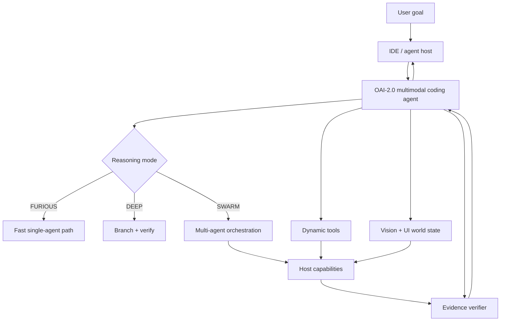

  

# OAI-2.0

> ⭐ If you find the architecture useful, consider starring the repository.

**ORCHORDS — BUILD DIFFERENT.**

OAI-2.0 is the public architecture and research workspace for a next-generation coding agent focused on native tool calling, code + vision reasoning, UI/UX testing, adaptive reasoning, native multi-agent orchestration, portable IDE/agent-host operation, evidence-driven verification, and compact fast local execution.

> **Project status: PROPOSED / RESEARCH.** Architecture documents describe targets unless explicitly marked IMPLEMENTED.

## Start here

| Topic | Document |
| --- | --- |
| Architecture index | [docs/agent-architecture/README.md](docs/agent-architecture/README.md) |
| System design | [SYSTEM_ARCHITECTURE.md](docs/agent-architecture/SYSTEM_ARCHITECTURE.md) |
| Tool calling | [TOOL_CALLING.md](docs/agent-architecture/TOOL_CALLING.md) |
| Vision/UI | [VISION_AND_UI.md](docs/agent-architecture/VISION_AND_UI.md) |
| Multi-agent | [MULTI_AGENT.md](docs/agent-architecture/MULTI_AGENT.md) |
| Reasoning/speed | [REASONING_AND_SPEED.md](docs/agent-architecture/REASONING_AND_SPEED.md) |
| Training/evaluation | [TRAINING_AND_EVALUATION.md](docs/agent-architecture/TRAINING_AND_EVALUATION.md) |
| Verification | [VERIFICATION_AND_EVIDENCE.md](docs/agent-architecture/VERIFICATION_AND_EVIDENCE.md) |
| Host compatibility | [HOST_COMPATIBILITY.md](docs/agent-architecture/HOST_COMPATIBILITY.md) |
| Security | [SECURITY_AND_SANDBOXING.md](docs/agent-architecture/SECURITY_AND_SANDBOXING.md) |
| Roadmap | [ROADMAP.md](docs/agent-architecture/ROADMAP.md) |
| Public references | [SOURCES.md](docs/agent-architecture/SOURCES.md) |

## Core idea

## Repository map

- `docs/agent-architecture/` — public architecture and research specifications
- `.github/` — contribution templates, ownership and documentation checks
- `CONTRIBUTING.md` — contribution workflow
- `SECURITY.md` — private vulnerability reporting
- `SUPPORT.md` — support and question routing
- `CODE_OF_CONDUCT.md` — community participation standard
- `CHANGELOG.md` — notable repository changes

## Public-repository boundary

This repository intentionally avoids private endpoints, credentials, internal deployment topology, sensitive datasets, provider arrangements, private training sources, customer data, and other non-public operational details.

Architecture documents distinguish **IMPLEMENTED**, **EXPERIMENTAL**, **PROPOSED**, and **BLOCKED** work. A diagram or design note is not evidence that a feature exists.

## Contributing

See [CONTRIBUTING.md](CONTRIBUTING.md). Security-sensitive findings go through [SECURITY.md](SECURITY.md), not public issues.

## Support

See [SUPPORT.md](SUPPORT.md).

## License

Non-commercial use only — see [LICENSE](LICENSE).

## Brand

**ORCHORDS — BUILD DIFFERENT.**

## Branding

The public OAI-2.0 brand package is documented in [BRANDING.md](BRANDING.md), with reusable assets under [assets/branding/](assets/branding/README.md).

**ORCHORDS — BUILD DIFFERENT.**
