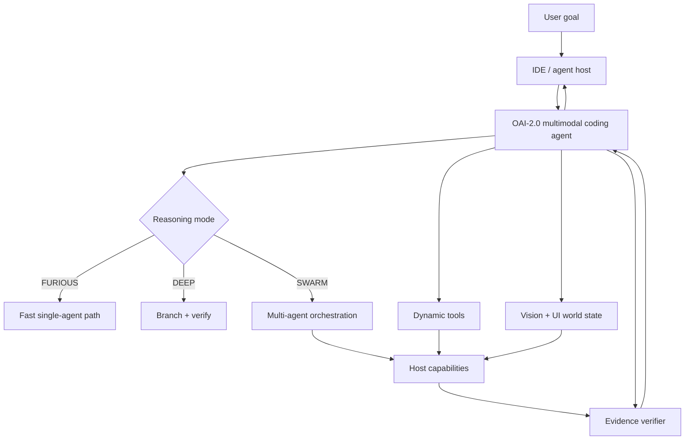

# OAI-2.0

Public architecture and research workspace for a next-generation coding agent focused on:

- native tool calling;
- code + vision reasoning;
- UI/UX testing and visual debugging;
- adaptive deep reasoning;
- native multi-agent orchestration;
- portable operation across IDEs and agent hosts;
- evidence-driven verification;
- compact, fast local execution.

> **Project status: PROPOSED / RESEARCH.** Architecture documents describe targets unless explicitly marked IMPLEMENTED.

## Start here

| Topic | Document |
| --- | --- |
| Architecture index | [docs/agent-architecture/README.md](docs/agent-architecture/README.md) |
| System design | [SYSTEM_ARCHITECTURE.md](docs/agent-architecture/SYSTEM_ARCHITECTURE.md) |
| Tool calling | [TOOL_CALLING.md](docs/agent-architecture/TOOL_CALLING.md) |
| Vision/UI | [VISION_AND_UI.md](docs/agent-architecture/VISION_AND_UI.md) |
| Multi-agent | [MULTI_AGENT.md](docs/agent-architecture/MULTI_AGENT.md) |
| Reasoning/speed | [REASONING_AND_SPEED.md](docs/agent-architecture/REASONING_AND_SPEED.md) |
| Training/evaluation | [TRAINING_AND_EVALUATION.md](docs/agent-architecture/TRAINING_AND_EVALUATION.md) |
| Verification | [VERIFICATION_AND_EVIDENCE.md](docs/agent-architecture/VERIFICATION_AND_EVIDENCE.md) |
| Host compatibility | [HOST_COMPATIBILITY.md](docs/agent-architecture/HOST_COMPATIBILITY.md) |
| Security | [SECURITY_AND_SANDBOXING.md](docs/agent-architecture/SECURITY_AND_SANDBOXING.md) |
| Roadmap | [ROADMAP.md](docs/agent-architecture/ROADMAP.md) |
| Public references | [SOURCES.md](docs/agent-architecture/SOURCES.md) |

## Core idea

## Public-repository boundary

This repository intentionally avoids private endpoints, credentials, internal deployment topology, sensitive datasets, provider arrangements, private training sources, customer data, and other non-public operational details.

See [CONTRIBUTING.md](CONTRIBUTING.md) and [SECURITY.md](SECURITY.md).

**ORCHORDS — BUILD DIFFERENT.**
