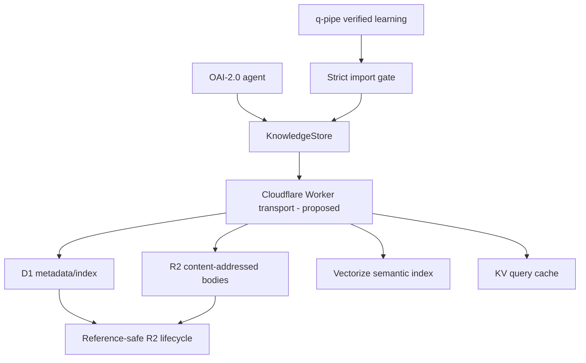

<p align="center">
  
</p>

# OAI-2.0

[](./LICENSE)
[](./docs/agent-architecture/README.md)

> ⭐ If OAI-2.0 is useful or interesting, consider starring the repository.

**ORCHORDS — BUILD DIFFERENT.**

OAI-2.0 is a public next-generation coding-agent research project focused on **large intelligence capacity with dynamically small active compute**: code + vision reasoning, native dynamic tools, evidence-driven verification, adaptive reasoning depth, and conditional multi-agent execution.

## Current state — 2026-10-02

_Documentation reconciled against current `main` during the 2026-10-02 repository-wide Markdown refresh; because parallel agents are active, the live branch may advance after this commit._

OAI-2.0 is no longer documentation-only. The repository contains an **EXPERIMENTAL implementation scaffold**, but the final custom model remains **PROPOSED**.

The master implementation map is [Issue #1](https://github.com/ORCHORDS-LCC/OAI-2.0/issues/1). This project intentionally uses **runner-free local verification**; GitHub Actions runners are not part of the acceptance workflow. A local preflight exists at `scripts/verify.py`; it must be executed locally for acceptance evidence.

| Area | Current status |
| --- | --- |
| Runner-free verification baseline (WP-01) | **IMPLEMENTED / CLOSED** — local preflight, failure semantics, platform/q-pipe PASS/FAIL/SKIP evidence |
| Python package, typed core/protocols | **EXPERIMENTAL** |
| Six-gate tool dispatcher | **EXPERIMENTAL** |
| FURIOUS / NORMAL / DEEP / SWARM controllers | **EXPERIMENTAL scaffold** |
| Evidence graph / claim state | **EXPERIMENTAL** |
| Four-view vision data model | **EXPERIMENTAL abstraction** — no trained vision encoder yet |
| Multi-agent orchestrator interfaces | **EXPERIMENTAL scaffold** — no production swarm runtime yet |
| Capability-eval harness | **EXPERIMENTAL** |
| MLX benchmark harness | **EXPERIMENTAL**, corrected prefill/decode split |
| Cloudflare knowledge contract + mocks | **EXPERIMENTAL source contract / tested mock behavior** |
| Versioned Cloudflare transport schemas | **EXPERIMENTAL source implementation** — D1 reader/writer, R2/KV/Vectorize wrappers, and D1/R2 delete-boundary pieces exist; authenticated Worker + private end-to-end proof still incomplete |
| R2 liveness dry-run reconciliation | **IMPLEMENTED work item / CLOSED #214** — non-destructive reconciliation and acceptance evidence recorded |
| Conservative R2 orphan sweep core | **EXPERIMENTAL / OPEN #215** — grace/recheck/idempotent decision core exists; controlled live destructive proof remains |
| D1 knowledge + GC transaction layer | **EXPERIMENTAL / OPEN #233** — durable revision/writer, lease persistence/runtime, and async D1/R2 delete boundary exist; sweep-planner/live concurrency proof remaining |
| R2 / KV / Vectorize Worker binding wrappers | **EXPERIMENTAL source implementation** — async R2 body/existence/delete, best-effort KV get/put, and Vectorize upsert/query wrappers; deployment proof remaining |
| QoS workload + admission/backpressure core | **EXPERIMENTAL source implementation** — admission policy and p95/p99/deadline promotion gate; live service/MLX integration remaining |
| Safe session batching scheduler | **EXPERIMENTAL source implementation** — exact-compatibility isolation/batching core exists; final-model/service performance proof remains |
| q-pipe compatibility/import gate | **IMPLEMENTED compatibility work item / CLOSED #20**; real 10–100 row migration remains **OPEN #21** |
| Async Cloudflare knowledge runtime | **EXPERIMENTAL source implementation** — D1/R2/Vectorize/KV orchestration with revision/integrity checks; authenticated Worker/network proof remaining |
| Live Cloudflare Worker transport | **PROPOSED / NOT YET VERIFIED** |
| Vectorize-backed semantic retrieval | **PROPOSED** |
| Custom 10–30B+ specialist model | **PROPOSED** |
| Android Studio / Hermes / OpenCode adapters | **PROPOSED** |

## Architecture target

The current source of truth is [ARCHITECTURE_TARGET.md](docs/agent-architecture/ARCHITECTURE_TARGET.md).

```text
Total specialist capacity:  ~10–30B+ eventually
FURIOUS active compute:     ~500M–1B
NORMAL active compute:      ~1–2B
DEEP active compute:        ~2–4B
SWARM:                      multiple ~1–2B+ lanes
```

These are research ranges, not a claim about a trained model currently in this repository.

## Current measured MLX smoke evidence

The corrected v0.2 benchmark harness has one committed smoke result for `mlx-community/Qwen2.5-0.5B-Instruct-4bit` on the M5 Max:

- prompt: 133 tokens;
- generated: 32 tokens;
- prefill / TTFT: ~25.44 ms;
- prefill throughput: ~5,227.9 tok/s;
- MLX-reported generation throughput: ~198.47 tok/s;
- end-to-end generation phase: ~191.10 ms;
- peak MLX memory: ~0.402 GB.

This is **one smoke repetition**, not an architecture benchmark. See [evals/benchmarks/README.md](evals/benchmarks/README.md).

The earlier ~102–334 tok/s bootstrap numbers used an older end-to-end measurement method and remain historical only.

## Knowledge architecture

OAI-2.0 keeps long-tail factual/project knowledge outside the final model weights.



Current source implements the application-level contract, deterministic mock bindings, cache revisioning, strict q-pipe importer, versioned public-safe Worker transport schemas, async D1 knowledge reader/writer plus R2/KV/Vectorize binding-facing primitives, non-destructive R2 liveness reconciliation, a conservative authorization/recovery-gated orphan-sweep core, a deterministic deletion-lease state model, a versioned D1 lease schema, an async D1 lease adapter with conditional acquire/revalidate/failure/finalize/release operations, and a durable D1 knowledge-index/corpus-revision writer that transactionally gates metadata writes on expected revision plus deletion-lease state; GC lease acquisition is now bound to the same authoritative corpus revision. Async D1, R2, KV, and Vectorize binding-facing primitives now exist, but source does **not** yet prove the complete authenticated Worker transport, end-to-end put/get/update/retrieve orchestration, sweep-planner integration against the D1-backed delete boundary, or a controlled live destructive R2 workflow.

The committed 50-row pilot is **synthetic test data**, not a real q-pipe corpus migration.

See [CLOUDFLARE_KNOWLEDGE.md](docs/agent-architecture/CLOUDFLARE_KNOWLEDGE.md).

## q-pipe import safety

Default imports mirror q-pipe's Cloudflare export rules:

- default sources: `scenario-forge`, `terminal-bench-2.1`;
- `android-curriculum-oss` requires explicit opt-in;
- promoted rows only by default;
- positive independent verification;
- success count must cover verification and exceed failure count;
- bounded fingerprint and structured guidance;
- unsafe guidance is rejected;
- accepted guidance receives a deterministic content hash.

## Documentation map

| Topic | Document |
| --- | --- |
| Architecture index | [docs/agent-architecture/README.md](docs/agent-architecture/README.md) |
| Architecture target | [ARCHITECTURE_TARGET.md](docs/agent-architecture/ARCHITECTURE_TARGET.md) |
| System architecture | [SYSTEM_ARCHITECTURE.md](docs/agent-architecture/SYSTEM_ARCHITECTURE.md) |
| Cloudflare knowledge | [CLOUDFLARE_KNOWLEDGE.md](docs/agent-architecture/CLOUDFLARE_KNOWLEDGE.md) |
| Tool calling | [TOOL_CALLING.md](docs/agent-architecture/TOOL_CALLING.md) |
| Vision/UI | [VISION_AND_UI.md](docs/agent-architecture/VISION_AND_UI.md) |
| Multi-agent | [MULTI_AGENT.md](docs/agent-architecture/MULTI_AGENT.md) |
| Reasoning/speed | [REASONING_AND_SPEED.md](docs/agent-architecture/REASONING_AND_SPEED.md) |
| Training/evaluation | [TRAINING_AND_EVALUATION.md](docs/agent-architecture/TRAINING_AND_EVALUATION.md) |
| Verification | [VERIFICATION_AND_EVIDENCE.md](docs/agent-architecture/VERIFICATION_AND_EVIDENCE.md) |
| Host compatibility | [HOST_COMPATIBILITY.md](docs/agent-architecture/HOST_COMPATIBILITY.md) |
| Security/sandboxing | [SECURITY_AND_SANDBOXING.md](docs/agent-architecture/SECURITY_AND_SANDBOXING.md) |
| Roadmap | [ROADMAP.md](docs/agent-architecture/ROADMAP.md) |
| Public sources | [SOURCES.md](docs/agent-architecture/SOURCES.md) |
| Issue/traceability standard | [ENGINEERING_ISSUE_STANDARD.md](docs/agent-architecture/ENGINEERING_ISSUE_STANDARD.md) |

## ⭐ Star OAI-2.0

⭐ https://github.com/ORCHORDS-LCC/OAI-2.0

Stars are voluntary and do not provide access, commercial rights, or control over project decisions.

## Donations & sponsorship

To support ORCHORDS public engineering, documentation, or research, contact **crm@orchords.com**.

Donations/sponsorship do not grant commercial rights, roadmap control, guaranteed implementation, or private access. Commercial licensing is separate and must be agreed in writing.

## License

**Non-commercial use only.** See [LICENSE](LICENSE).

## Contact

Public contact: **crm@orchords.com**

## Branding

See [BRANDING.md](BRANDING.md) and [assets/branding/](assets/branding/README.md).

**ORCHORDS — BUILD DIFFERENT.**
