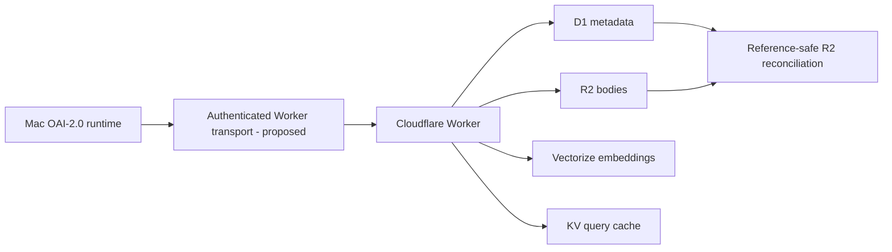
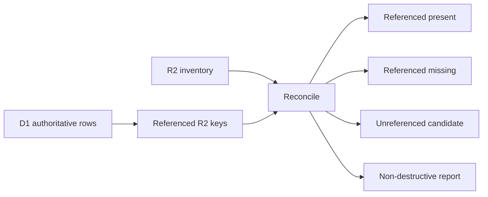
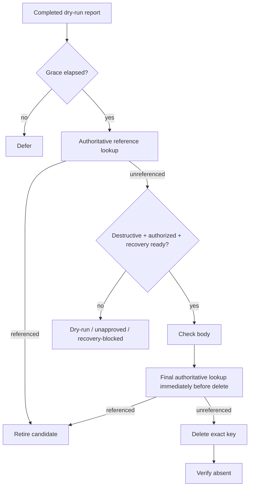

# Cloudflare Knowledge Architecture

_Last reviewed against current Cloudflare documentation and repository source: 2026-10-02._

> **Current status:** application-level storage contract, deterministic mocks, strict import gate, versioned transport/schema models, async source-level D1/R2/KV/Vectorize binding wrappers, non-destructive R2 liveness reconciliation, conservative sweep logic, deterministic GC lease semantics, a versioned STRICT D1 lease schema, and an async D1 binding-facing lease adapter are implemented in source. Conditional lease acquisition, pre-delete revalidation, failure/finalize/release transitions, and focused SQLite/async binding tests now exist. Async D1, R2, KV, and Vectorize binding-facing primitives now exist in source. Live Worker deployment, full transport orchestration, destructive sweep-planner integration against the D1-backed delete boundary, and controlled private demonstrations remain **NOT YET VERIFIED END-TO-END**. A durable D1 knowledge-index/corpus-revision reader/writer contract, async D1 knowledge reader, and lease-aware transactional metadata writer now exist in source.

## Verified architecture boundary

The local OAI-2.0 runtime should not pretend Cloudflare Worker bindings are ordinary local Python calls. Current Cloudflare bindings are capabilities exposed **inside Workers** and their D1/R2/KV/Vectorize operations are asynchronous.

The repository exposes an **application-level `CloudflareBindingAdapter` protocol** plus versioned public-safe transport models in `oai2/knowledge/transport.py`. Those models define request/response, normalized authenticated identity, explicit error classes, D1 metadata, R2 body descriptors, Vectorize metadata, and KV cache envelopes. A future live Worker must translate that contract to native Cloudflare APIs.



## Versioned transport contract

Current source defines:

- `TRANSPORT_VERSION`;
- `KnowledgeTransportRequest` / `KnowledgeTransportResponse`;
- `TransportAuthContext` containing normalized identity/capabilities but no bearer credential;
- explicit authorization, validation, not-found, conflict, dependency, integrity and internal error classes;
- `D1KnowledgeIndexRecord` with authoritative corpus revision;
- `R2BodyDescriptor` with content-hash verification;
- `VectorizeMetadata` carrying embedding version and provenance fields;
- `QueryCacheEnvelope` keyed by corpus revision and embedding digest.

These are contract/schema objects only. They do **not** prove a live Worker, live D1/R2/Vectorize/KV bindings, authentication middleware, or a network round trip.

## Service roles

### D1

Source/index metadata and pointers. The logical adapter stores one metadata row per `KnowledgeObject`. D1 metadata and revision state are authoritative for lifecycle decisions.

### R2

Content-addressed knowledge bodies under a hash-derived object key. R2 is used for bodies/artifacts rather than bloating D1 rows.

`oai2/knowledge/cloudflare_bindings_runtime.py` now provides an async binding-facing `CloudflareR2Store` wrapper over documented Worker operations for text put/get, head-based existence checks, and delete. This is source-level binding integration only; no production bucket binding or private deployment round trip is claimed.

### Vectorize

Intended semantic index keyed back to knowledge IDs. `CloudflareVectorizeStore` now provides a deployment-neutral async Worker-binding wrapper for documented `upsert([{id, values, metadata}])` and `query(vector, {topK})` operations, with fail-closed match parsing. Vectorize mutations are eventually query-visible, so source does not treat successful upsert return as immediate query visibility. `KnowledgeStore.retrieve()` still does **not yet use a deployed production Vectorize index end-to-end**.

Cloudflare's current Vectorize API uses vector objects such as `{id, values, metadata}`; updating existing IDs uses `upsert`. Mutations are asynchronous and may take time to become query-visible.

### Workers KV

Best-effort query-result cache only. KV is eventually consistent, so it must never be the authority for knowledge lifecycle state or write-after-write correctness.

`CloudflareKvCache` now wraps async Worker KV get/put calls with explicit string handling and TTL validation. It remains cache-only and is not used as lifecycle authority.

Current logical cache keys include both an embedding-version digest and a corpus revision. Corpus revision belongs in an authoritative store such as D1, not KV.

## Cache correctness

A write advances the logical corpus revision through the application-level atomic D1 operation. Retrieval cache keys include that revision, preventing old cached query results from being selected after a corpus change.

KV reads/writes are best-effort. Cached references are rehydrated and content-hash checked through authoritative D1/R2 state; malformed, stale, wrong-hash, or unavailable KV entries do not become authoritative knowledge.

## Content-addressed R2 body lifecycle

### Non-destructive reconciliation

`oai2/knowledge/gc.py` implements an **EXPERIMENTAL source-level dry-run reconciler**:



The reconciler:

- groups shared content-addressed bodies by all referring knowledge IDs;
- distinguishes referenced-present, referenced-missing, and unreferenced-candidate states;
- records available count, byte, and age information;
- supports paginated/resumable inventory state;
- validates snapshot schema, cursor/completion consistency, inventory metadata, and authoritative-reference fingerprint;
- rejects a conflicting page atomically;
- never deletes R2 data.

WI-GC-001 / #214 is **closed** with recorded acceptance evidence for the non-destructive reconciliation scope. That does not authorize destructive cleanup.

### Conservative sweep core

`oai2/knowledge/sweep.py` implements an **EXPERIMENTAL source-level sweep decision core** behind dry-run and explicit safeguards:



The core currently provides:

- grace-period deferral before any destructive dependency call;
- two authoritative reference checks, including one immediately before deletion;
- retirement of re-referenced candidates so a new dry-run/grace cycle is required before future deletion eligibility;
- dry-run default;
- separate destructive authorization and recovery-readiness gates;
- strict boolean dependency results and fail-closed behavior;
- explicit deleted, already-absent, failed, unapproved, recovery-blocked, deferred, and re-referenced outcomes;
- bounded processing with retry at the failed cursor;
- idempotent repeated execution;
- versioned, integrity-fingerprinted checkpoints.

Focused sweep tests exercise the decision core, but this is **not** a live R2 deletion claim. #215 remains open for grace/recheck/idempotent destructive-sweep acceptance, and #233 remains open for D1 lease/concurrent-reference exclusion plus live concurrency proof.

### D1 deletion lease and writer exclusion

The final reference check and the external R2 deletion cannot participate in one cross-service transaction. `oai2/knowledge/gc_lease.py` therefore defines an **EXPERIMENTAL deterministic D1-authority state model** for the live transaction layer required by #233:

```mermaid
sequenceDiagram
    participant GC as GC worker
    participant D1 as D1 authority
    participant WR as knowledge writer
    participant R2 as R2

    GC->>D1: acquire claim if revision matches and no references
    alt claim active
        WR->>D1: add reference
        D1-->>WR: blocked by deletion lease
        GC->>D1: validate fencing token
        GC->>R2: delete body
        GC->>D1: finalize / record retryable failure
    else reference exists
        D1-->>GC: referenced; no claim
    end
```

The source model currently covers:

- expected-revision acquisition;
- existing-reference rejection;
- active/failed claim writer exclusion;
- expired-claim takeover with old-token fencing;
- retryable delete failure while references remain blocked;
- token-validated release/finalize;
- idempotent repeated finalize;
- deleted-body tombstone that requires explicit verified restore before references can be reactivated.

Current source has advanced beyond the deterministic model:

- `oai2/knowledge/gc_lease_d1.py` defines a versioned STRICT D1 persistence contract;
- conditional acquisition refuses stale corpus revisions, retained references and live leases, permits expired/released takeover, and rechecks both authoritative corpus revision and references on conflict update;
- pre-delete validation checks exact token, state, expiry, and authoritative retained-reference absence;
- delete-failure, release, and delete/already-absent finalization are token/expiry guarded;
- `oai2/knowledge/gc_lease_d1_runtime.py` consumes the documented async D1 `prepare/bind/run/first/batch` surface;
- mutation success is fail-closed using D1 result success plus `meta.changes`;
- focused SQLite semantics tests and async fake-binding contract tests cover these paths.

This is still **not** full live-Worker proof. Current source now includes `oai2/knowledge/knowledge_d1.py` with a durable `knowledge_index` schema, singleton corpus-revision authority, lease-aware conditional metadata upsert, read/query SQL contracts, and revision-advance SQL, plus `D1KnowledgeReader` / `D1KnowledgeWriter` binding-facing components, plus `D1KnowledgeWriter` which executes the metadata write and revision advance in one D1 batch transaction using one expected revision. A write is denied when the expected revision is stale or the target R2 key has an active deletion lease, and inconsistent mutation counts fail closed. Current source now also includes `oai2/knowledge/gc_delete_d1_runtime.py`, an async D1/R2 delete boundary that acquires the D1 lease, revalidates it immediately before the R2 operation, handles already-absent/delete-failure/post-delete verification, and finalizes or records retryable failure through the D1 store. The conservative sweep planner is not yet wired to invoke this boundary end-to-end in a live Worker, and no controlled private Worker/D1/R2 concurrency demonstration has been recorded.

## q-pipe import contract

Default OAI imports match q-pipe's Cloudflare export eligibility:

- `scenario-forge` and `terminal-bench-2.1` are default sources;
- `android-curriculum-oss` requires explicit operator opt-in;
- promoted rows only by default;
- `verified_count >= 1`;
- `success_count >= verified_count`;
- `success_count > failure_count`;
- bounded fingerprint;
- bounded structured guidance;
- at least steps or verification guidance;
- secrets/unsafe public paths rejected;
- accepted content hash is computed from the verified guidance JSON.

The committed 50-row test is **synthetic** and validates importer/store round-trip behavior. It is not evidence that a live q-pipe database has been migrated.

## Current implementation limitations

- versioned transport schemas exist, but no live Worker endpoint/network adapter is verified yet;
- public-safe D1 lease schema, D1 knowledge-index/corpus-revision schema, async lease adapter, and transactional metadata writer exist, but no production migration/deployment has been demonstrated;
- async R2, KV, and Vectorize binding wrappers exist, but no production bucket/namespace/index bindings or deployed Worker round trip has been demonstrated;
- no real q-pipe corpus migration;
- no production embeddings pipeline;
- no network integration test;
- no controlled private R2 sweep demonstration;
- D1 claim acquisition/revalidation/outcome operations, a lease-aware normal metadata writer, and an async D1/R2 destructive-delete boundary exist at binding level, but full sweep-planner integration and live Worker deployment are not demonstrated;
- current GC/sweep/lease evidence is focused local source testing, not a full current-main Mac preflight.

## Public-safe deployment rule

Real account IDs, database IDs, private bucket names, namespace IDs, API tokens, and private endpoints belong only in deployment secrets/configuration—not public Markdown/source.

## Official references

See [SOURCES.md](SOURCES.md) for current D1, R2, Vectorize, KV, bindings, and Python Workers documentation.
