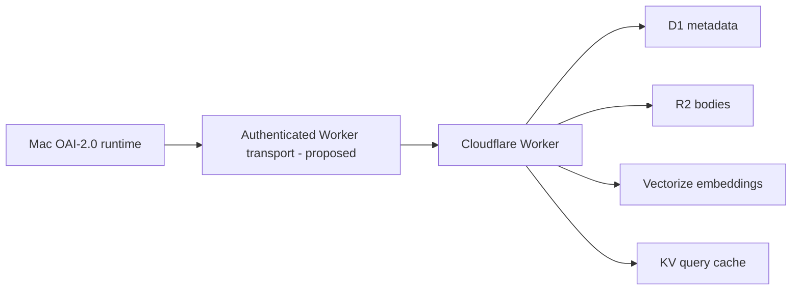

# Cloudflare Knowledge Architecture

_Last reviewed against current Cloudflare documentation: 2026-10-01._

> **Current status:** application-level contract + deterministic mocks are implemented/tested. Live Cloudflare network transport and production semantic retrieval remain **PROPOSED**.

## Verified architecture boundary

The local OAI-2.0 runtime should not pretend Cloudflare Worker bindings are ordinary local Python calls. Current Cloudflare bindings are capabilities exposed **inside Workers** and their D1/R2/KV/Vectorize operations are asynchronous.

The repository therefore exposes an **application-level `CloudflareBindingAdapter` protocol**. A future live Worker translates that protocol to native Cloudflare APIs.

## Service roles

### D1

Source/index metadata and pointers. The logical adapter stores one metadata row per `KnowledgeObject`.

### R2

Content-addressed knowledge bodies under a hash-derived object key. R2 is used for bodies/artifacts rather than bloating D1 rows.

### Vectorize

Intended semantic index keyed back to knowledge IDs. Current mock tests prove vector ranking behavior, but `KnowledgeStore.retrieve()` does **not yet use production Vectorize semantic search**.

Cloudflare's current Vectorize API uses vector objects such as `{id, values, metadata}`; updating existing IDs uses `upsert`. Mutations are asynchronous and may take time to become query-visible.

### Workers KV

Best-effort query-result cache only. KV is eventually consistent, so it must never be the authority for knowledge lifecycle state or write-after-write correctness.

Current logical cache keys include both an embedding-version digest and a corpus revision. A future live adapter should persist/bump the corpus revision in an authoritative store such as D1 rather than relying on KV for revision correctness.

## Cache correctness

A write increments the logical corpus revision. Retrieval cache keys include that revision, preventing old cached query results from being selected after a corpus change.

This fixes the earlier scaffold behavior where a cached query could remain stale after `put()`.

## q-pipe import contract

Default OAI imports now match q-pipe's Cloudflare export eligibility:

- `scenario-forge` and `terminal-bench-2.1` are default sources;
- `android-curriculum-oss` requires explicit operator opt-in;
- promoted rows only by default;
- `verified_count >= 1`;
- `success_count >= verified_count`;
- `success_count > failure_count`;
- bounded fingerprint;
- bounded structured guidance;
- at least steps or verification guidance;
- secrets/unsafe public paths rejected;
- accepted content hash is computed from the verified guidance JSON.

The committed 50-row test is **synthetic** and validates importer/store round-trip behavior. It is not evidence that a live q-pipe database has been migrated.

## Current implementation limitations

- no live Worker endpoint in this public repository;
- no production D1 schema migration/deployment;
- no production R2 bucket binding;
- no production Vectorize index binding;
- no production KV namespace binding;
- no real q-pipe corpus migration;
- no production embeddings pipeline;
- no network integration test.

## Public-safe deployment rule

Real account IDs, database IDs, bucket names when private, namespace IDs, API tokens, and private endpoints belong only in deployment secrets/configuration—not public Markdown/source.

## Official references

See [SOURCES.md](SOURCES.md) for current D1, R2, Vectorize, KV, bindings, and Python Workers documentation.
