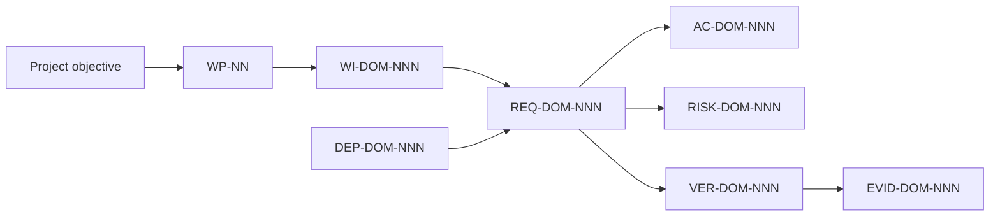

# OAI-2.0 Engineering Issue and Traceability Standard

_Reconciliation baseline: `8520cdb5d8d3e49bc9e12dfd79ccf59e7422e44d` (source state before this documentation commit)._

_Last reviewed: 2026-10-02._

## Purpose

This document defines the repository's engineering issue, work-package, requirement, verification, risk, and evidence nomenclature.

It is **standards-aligned**. It does **not** claim certification or full organizational conformity to any ISO/IEC/IEEE standard.

## Repository execution policy

For `ORCHORDS-LCC/OAI-2.0`:

- canonical branch: **`main` only**;
- routine work: **direct push to `main`**;
- **no GitHub-hosted runners**;
- **no self-hosted runners**;
- **no GitHub Actions runner-based acceptance**;
- local/manual verification is the project acceptance path;
- commit messages describe the change only, not runner names, workflow IDs, operational logs, or machine-run records;
- because multiple AIs may work concurrently, active agents shall re-fetch remote `main` approximately every 3 minutes and immediately before each commit, reconciling overlapping work instead of force-updating.

## Standards used as terminology/process references

- **ISO/IEC/IEEE 29148:2018** — requirements engineering. ISO confirms this edition remains current while a replacement DIS is under development.
- **ISO/IEC/IEEE 12207:2026** — software life-cycle processes. This supersedes the withdrawn 2017 edition.
- **ISO/IEC 25010:2023** — product quality model.
- **ISO/IEC/IEEE 29119-2:2021** — software test processes.
- **ISO/IEC/IEEE 29119-3:2021** — software test documentation.
- **ISO/IEC 23894:2023** — AI risk-management guidance.
- **ISO/IEC 42001:2023** — AI management-system requirements, used here only for management/risk terminology guidance.

## Canonical identifiers

Every detailed implementation issue should use stable identifiers.

| Identifier | Meaning | Example |
| --- | --- | --- |
| `WP-NN` | Work Package | `WP-03` |
| `WI-DOM-NNN` | Work Item under a Work Package | `WI-KNOW-001` |
| `REQ-DOM-NNN` | Requirement | `REQ-KNOW-001` |
| `AC-DOM-NNN` | Acceptance Criterion | `AC-KNOW-001` |
| `VER-DOM-NNN` | Verification Item | `VER-KNOW-001` |
| `RISK-DOM-NNN` | Risk | `RISK-KNOW-001` |
| `DEP-DOM-NNN` | Dependency | `DEP-KNOW-001` |
| `EVID-DOM-NNN` | Evidence Record | `EVID-KNOW-001` |

Current domain codes:

- `VV` — verification/validation;
- `KNOW` — Cloudflare knowledge;
- `MIG` — q-pipe migration/import;
- `RET` — retrieval/evidence packaging;
- `PERF` — performance/benchmarking;
- `ARCH` — model architecture;
- `DEC` — decoding/inference optimization;
- `EVAL` — capability evaluation;
- `VIS` — vision/UI;
- `TOOL` — tool runtime;
- `AGT` — multi-agent;
- `HOST` — host/protocol integration;
- `SEC` — security/public safety;
- `AI` — AI risk/management;
- `DOC` — documentation/traceability;
- `MODEL` — model scaling/final acceptance;
- `GC` — content-addressed storage lifecycle/garbage collection;
- `NUM` — numerical stability/precision;
- `SEARCH` — architecture/hyperparameter search;
- `SDK` — client SDKs/typed APIs;
- `DIST` — model/artifact distribution integrity;
- `TRUTH` — claim/evidence enforcement and contradiction handling;
- `QOS` — end-to-end latency/tail/service-quality budgets.

The domain list is extensible; use the owning issue's established code rather than inventing a duplicate synonym.

## Requirement language

Use **shall** for a mandatory requirement.

Example:

> `REQ-KNOW-001`: The live knowledge transport **shall** preserve the source content hash across write/read round trips.

Avoid ambiguous requirement words such as "proper", "good", "fast", "smart", or "works" unless an objective measure is supplied.

A requirement should be:

- uniquely identified;
- necessary;
- unambiguous;
- feasible;
- verifiable;
- traceable to a parent objective/dependency;
- implementation-independent where practical.

## Required issue information model

Every implementation issue should contain:

1. Work Package or Work Item ID and title
2. Parent / traceability
3. Problem statement
4. Objective
5. Scope
6. Out of scope
7. Current state / baseline
8. Dependencies
9. Requirements
10. Quality characteristics
11. Risks and controls
12. Implementation plan
13. Acceptance criteria
14. Verification plan
15. Evidence required
16. Source references
17. Completion / closure rule

## Quality-characteristic vocabulary

Where relevant, use ISO/IEC 25010:2023 product-quality terminology:

- functional suitability;
- performance efficiency;
- compatibility;
- interaction capability;
- reliability;
- security;
- maintainability;
- flexibility;
- safety.

Only include characteristics materially affected by the work package.

## Verification terminology

Use explicit verification methods:

- **Inspection** — source/config/document review;
- **Analysis** — static, calculated, benchmark, or traceability evidence;
- **Test** — controlled execution with expected result;
- **Demonstration** — observable end-to-end behavior in the target environment.

For software tests, record:

- test item;
- preconditions;
- input/test data;
- procedure;
- expected result;
- observed result;
- pass/fail;
- evidence location.

This is aligned with the intent of ISO/IEC/IEEE 29119-2 and 29119-3 without reproducing copyrighted standard text.

## Traceability



An issue must not close because code merely exists. Closure requires evidence that all mandatory acceptance criteria are met.

## Risk format

Use:

```text
RISK-ID:
Cause:
Event:
Consequence:
Likelihood:
Impact:
Control:
Residual risk:
Owner:
```

For AI-specific work, include model-capability regression, unsafe autonomy, misleading confidence, data/provenance, security, and resource risks when applicable.

## Child-issue reporting

When an AI agent works a work package, report:

### INSPECTED
Exact current `main` SHA and source inspected.

### SYNC STATUS
Exact remote `main` recheck and any concurrent-agent commits reconciled.

### GAP
Requirement(s) not yet satisfied.

### RESEARCH
Primary/official sources checked.

### IMPLEMENTED
Exact files/modules changed.

### LOCAL VERIFICATION
Exact local commands and summarized pass/fail.

### BENCHMARK
Measured values only; targets must be clearly marked as targets.

### CAPABILITY IMPACT
Observed capability improvement/regression.

### RISK UPDATE
Changed/new risks and mitigations.

### EVIDENCE
Map evidence to `VER-*` / `EVID-*`.

### COMMIT
Exact direct-`main` commit SHA.

### NEXT
Next dependency-ordered requirement.

Do not include runner names, workflow IDs, Actions run IDs, runner logs, or runner records.

## Closure rule

A work package closes only when:

- every mandatory `REQ-*` is implemented or explicitly dispositioned;
- every `AC-*` passes;
- every required `VER-*` has evidence;
- material risks have controls/residual-risk notes;
- docs reflect the real state;
- the final direct-`main` SHA is recorded in the issue.

## Master traceability

Master implementation map:

- [GitHub Issue #1](https://github.com/ORCHORDS-LCC/OAI-2.0/issues/1)

**ORCHORDS — BUILD DIFFERENT.**
