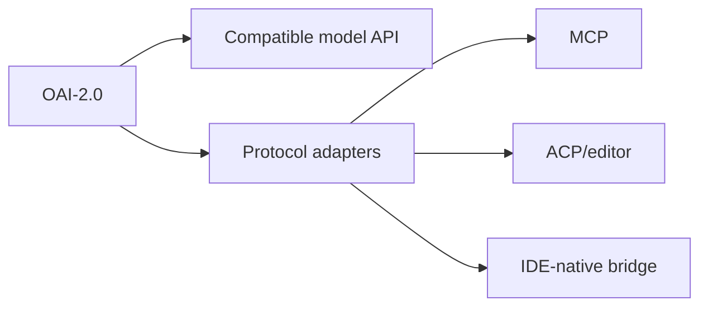

# Host Compatibility

_Last reviewed: 2026-10-01._

> **Current status:** host integrations are **PROPOSED**. OAI-2.0 currently has internal protocol/tool abstractions, not a compatibility certification for any IDE/agent host.

## Target surfaces

## Publicly documented host capabilities

| Host | Public capability relevant to OAI-2.0 | OAI-2.0 status |
| --- | --- | --- |
| Android Studio | local third-party models, agent/tool workflows, MCP-related capabilities | **PROPOSED integration** |
| Hermes Agent | MCP and ACP/editor integration | **PROPOSED integration** |
| OpenCode | custom providers and MCP | **PROPOSED integration** |
| Other hosts | varies | inspect live contract before claiming support |

## Compatibility proof

A support claim must record host version, OAI adapter/runtime version, protocol path, tool-call behavior, streaming, multimodal behavior, cancellation/error recovery, and known limitations.

See [SOURCES.md](SOURCES.md).
