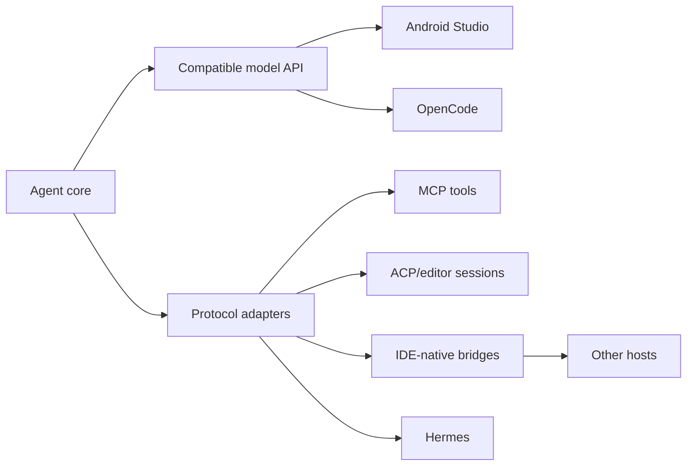
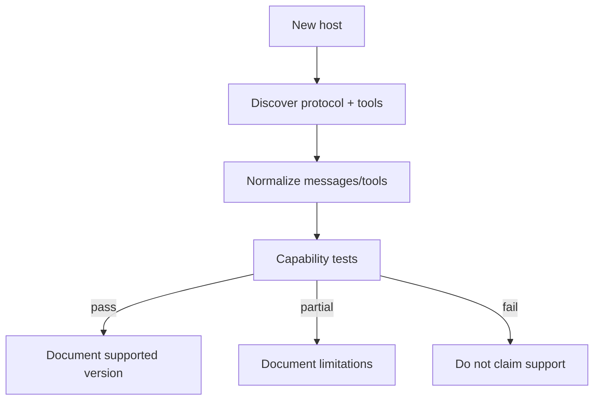

# Host compatibility

> **Status: PROPOSED adapters.** External capabilities are based on public vendor documentation reviewed 2026-10-01. That does not mean OAI-2.0 already works in those hosts.

## Strategy

| Host | Publicly documented capability | Target |
| --- | --- | --- |
| Android Studio | local third-party model support and agent/tool workflows | compatible serving plus feature-by-feature testing |
| Hermes Agent | MCP tool discovery and ACP editor integration | dynamic tools and editor integration |
| OpenCode | custom providers and MCP | compatible provider endpoint plus tool behavior |
| Other hosts | varies | inspect the live contract before claiming support |

## Unknown host flow

Every compatibility claim should record host version, adapter/runtime version, tested capabilities and known failures.

See [Sources](SOURCES.md).
