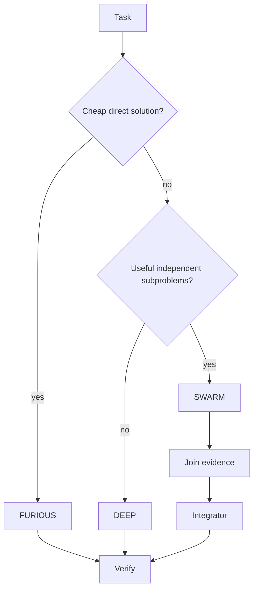

# Native Multi-Agent Orchestration

_Last reviewed: 2026-10-02._

> **Current status:** orchestrator/spec/context types and FURIOUS/NORMAL/DEEP/SWARM controller scaffolds are **EXPERIMENTAL**. Real parallel inference, isolated write workspaces, messaging transport, and production merging are **PROPOSED**.

## Current source boundary

Current source has orchestrator/spec/context types and controller scaffolds, but not a production parallel inference scheduler, isolated mutation workspaces, or evidence-proven SWARM speedup. QoS/admission and safe session-batching work can constrain future SWARM resource use but are not themselves a swarm implementation.

## Principle

Multi-agent execution is conditional. A sequential task should not become a swarm merely because multiple agents are available.

## Target routing

## Target operations

Spawn, delegate, message, inspect, join, cancel, and merge are semantic operations. Exact host wire formats remain adapter-specific.

## Integration rule

Parallel investigation; controlled integration. Multiple agents should not blindly mutate one shared working tree at the same time.

## Shared state

Repository snapshots, visual encodings, evidence, knowledge, build results, and tool outputs should be referenced from shared immutable state rather than duplicated into every prompt.

## Evaluation requirement

Measure whether SWARM actually improves verified completion versus DEEP/single-agent execution at the same time/resource budget.
