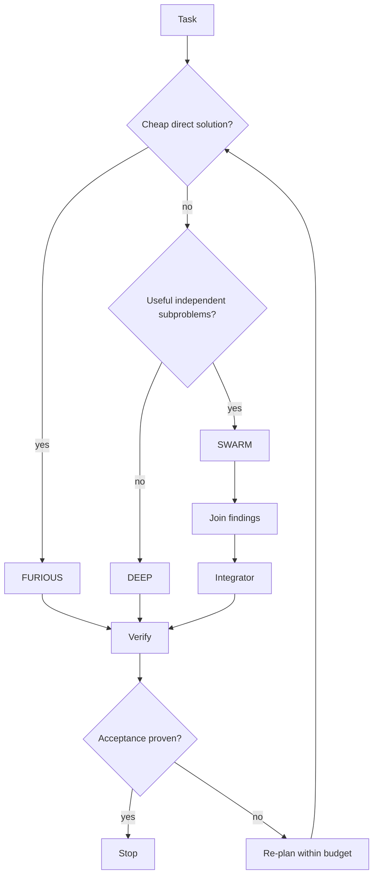
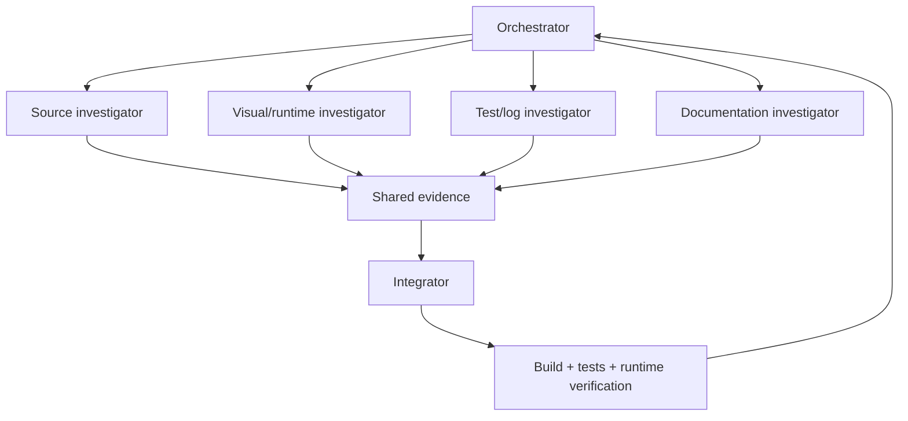
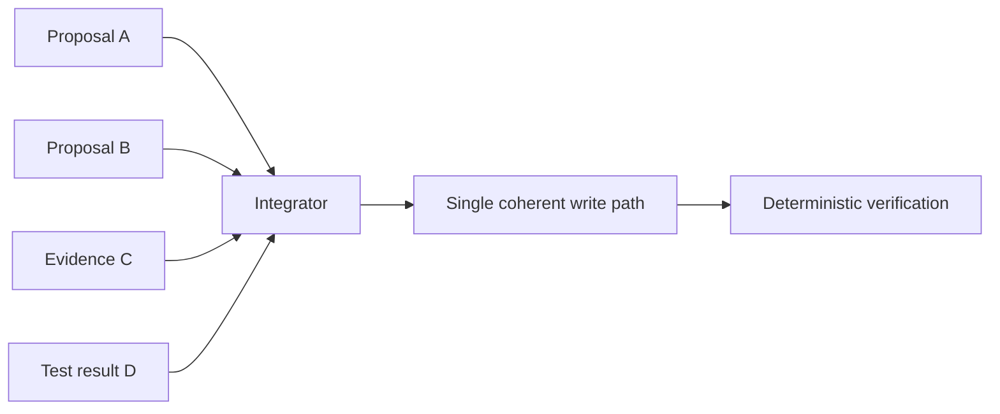

# Native multi-agent orchestration

> **Status: PROPOSED.**

The same core model may act as primary agent or as scoped subagents with different goals, tools and budgets.

## Adaptive modes

Native orchestration semantics include spawn, delegate, message, inspect, join, cancel and merge.

## Example swarm

## Parallel research, serial integration

Controls include maximum depth/count, per-agent budgets, no child privilege escalation, duplicate-work cancellation and measured benefit before raising parallelism.
