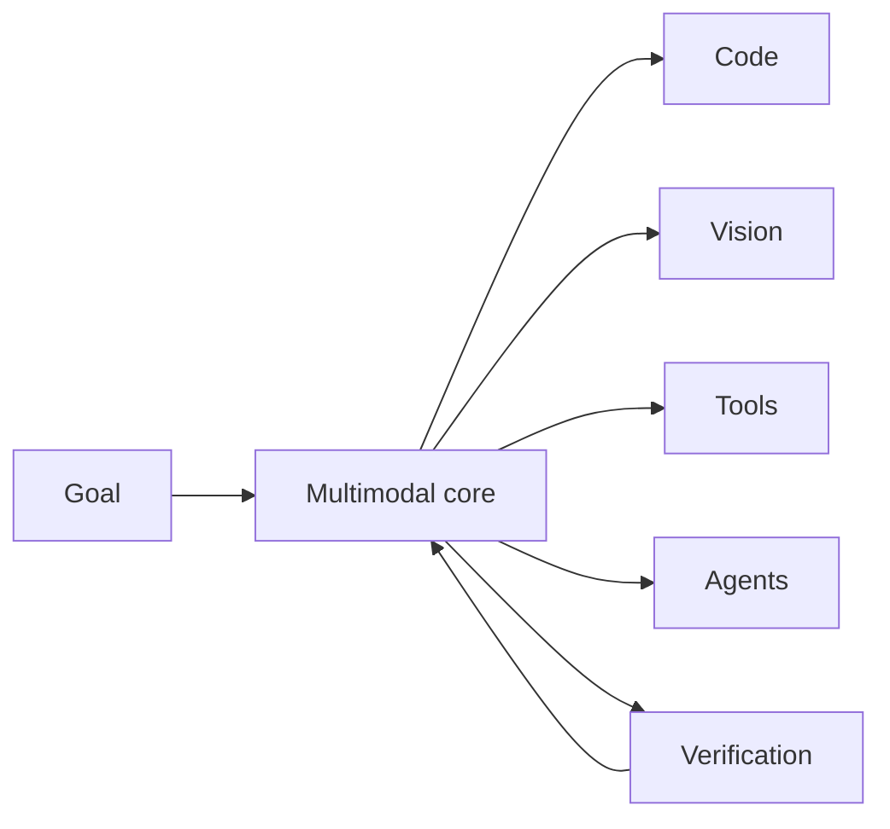

# OAI-2.0 agent architecture

> **Status: PROPOSED.** This folder describes public architecture targets, not completed implementation claims.

## Status language

| Label | Meaning |
| --- | --- |
| **IMPLEMENTED** | Code and repository proof exist. |
| **EXPERIMENTAL** | Prototype/evaluation exists but is not production-supported. |
| **PROPOSED** | Design target only. |
| **BLOCKED** | Work is stopped on a named dependency or missing proof. |

## Documentation map

- [System architecture](SYSTEM_ARCHITECTURE.md)
- [Portable tool calling](TOOL_CALLING.md)
- [Vision and UI](VISION_AND_UI.md)
- [Multi-agent orchestration](MULTI_AGENT.md)
- [Reasoning and speed](REASONING_AND_SPEED.md)
- [Training and evaluation](TRAINING_AND_EVALUATION.md)
- [Verification and evidence](VERIFICATION_AND_EVIDENCE.md)
- [Host compatibility](HOST_COMPATIBILITY.md)
- [Security and sandboxing](SECURITY_AND_SANDBOXING.md)
- [Roadmap](ROADMAP.md)
- [Sources](SOURCES.md)

## Design principles

1. **Agent, not chatbot.**
2. **Vision is native**, not a bolt-on.
3. **Tools are dynamic** and learned from schemas.
4. **Multi-agent execution is conditional.**
5. **Verification outranks confidence.**
6. **Easy tasks remain fast.**
7. **Host adapters are separate from core reasoning.**
8. **Unsupported claims remain unverified.**
9. **Public docs stay provider-neutral and non-sensitive.**

