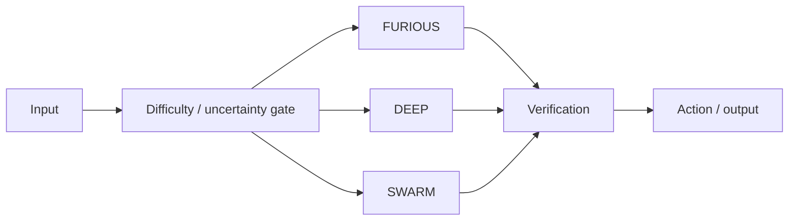

# Reasoning strength and speed

> **Status: PROPOSED.** Performance claims require benchmark proof.

| Mode | Intended use | Behavior |
| --- | --- | --- |
| **FURIOUS** | obvious/local tasks | minimum branching, fastest useful action |
| **DEEP** | ambiguity/conflicting evidence | bounded alternatives + verification |
| **SWARM** | parallelizable hard tasks | scoped agents + shared state + integrator |



## Speed principles

- encode repository regions once per version;
- encode screenshots once per capture;
- cache deterministic results with invalidation;
- reference large artifacts instead of repeatedly injecting them;
- share immutable context across agents;
- use cheap perception before high-resolution inspection;
- batch compatible work where supported;
- stop when evidence already proves completion.

```text
total latency =
 host overhead
 + model decision latency
 + tool latency
 + optional vision
 + optional verification
 + optional agent coordination
```

Measure time to first useful action, end-to-end latency, tool calls, repeated context avoided, image encodes, peak memory, task success at fixed budgets and correct reasoning-mode selection.
