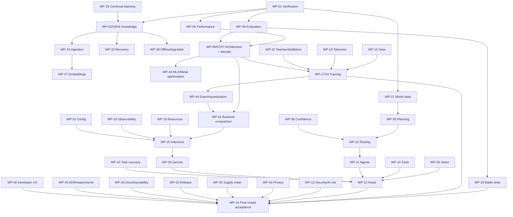

# Implementation Roadmap

_Last reviewed: 2026-10-02._

Stages are evidence gates, not delivery promises. The detailed dependency-ordered implementation map lives in [GitHub Issue #1](https://github.com/ORCHORDS-LCC/OAI-2.0/issues/1).

OAI-2.0 uses **runner-free local verification**. Do not make GitHub Actions runners part of an acceptance gate.

| Stage | Scope | Current status |
| --- | --- | --- |
| 0 | Public architecture/contracts | **IMPLEMENTED docs** |
| 1 | Host-neutral protocol/tool types | **EXPERIMENTAL scaffold** |
| 2 | Fast single-agent controllers | **EXPERIMENTAL scaffold** |
| 3 | Vision/UI grounding | **EXPERIMENTAL data model; real grounding PROPOSED** |
| 4 | Evidence verification | **EXPERIMENTAL scaffold** |
| 5 | Native multi-agent | **EXPERIMENTAL orchestration scaffold; real swarm PROPOSED** |
| 6 | Adaptive routing/depth/custom model | **PROPOSED** |
| 7 | Host adapters | **PROPOSED** |
| 8 | Production hardening | **IN PROGRESS foundations; production PROPOSED** |

## Master work-package map

The canonical detailed dependency map is [Master Issue #1](https://github.com/ORCHORDS-LCC/OAI-2.0/issues/1). Every detailed child work item is inserted into that master issue when created.

| Work package | Issue | Domain | Current state |
| --- | --- | --- | --- |
| WP-01 | [#2](https://github.com/ORCHORDS-LCC/OAI-2.0/issues/2) | Verification/validation | **COMPLETED / CLOSED** |
| WP-02 | [#3](https://github.com/ORCHORDS-LCC/OAI-2.0/issues/3) | Live Cloudflare knowledge | **EXPERIMENTAL source runtime assembled** from D1 reader/writer + R2/KV/Vectorize wrappers + D1/R2 GC delete boundary; authenticated Worker/private deployment proof remaining |
| WP-03 | [#4](https://github.com/ORCHORDS-LCC/OAI-2.0/issues/4) | Real q-pipe migration | PROPOSED |
| WP-04 | [#5](https://github.com/ORCHORDS-LCC/OAI-2.0/issues/5) | Semantic retrieval/evidence | PROPOSED |
| WP-05 | [#6](https://github.com/ORCHORDS-LCC/OAI-2.0/issues/6) | Performance baselines | EXPERIMENTAL harness / matrix remaining |
| WP-06 | [#7](https://github.com/ORCHORDS-LCC/OAI-2.0/issues/7) | Sparse routing/adaptive depth | PROPOSED |
| WP-07 | [#8](https://github.com/ORCHORDS-LCC/OAI-2.0/issues/8) | Decode optimization | PROPOSED |
| WP-08 | [#9](https://github.com/ORCHORDS-LCC/OAI-2.0/issues/9) | Capability/regression evaluation | EXPERIMENTAL scaffold / expansion remaining |
| WP-09 | [#10](https://github.com/ORCHORDS-LCC/OAI-2.0/issues/10) | Vision/UI grounding | EXPERIMENTAL data model / runtime remaining |
| WP-10 | [#11](https://github.com/ORCHORDS-LCC/OAI-2.0/issues/11) | Dynamic tool runtime | EXPERIMENTAL dispatcher / execution remaining |
| WP-11 | [#12](https://github.com/ORCHORDS-LCC/OAI-2.0/issues/12) | Native multi-agent | EXPERIMENTAL scaffold / runtime remaining |
| WP-12 | [#13](https://github.com/ORCHORDS-LCC/OAI-2.0/issues/13) | Host/protocol integrations | PROPOSED |
| WP-13 | [#14](https://github.com/ORCHORDS-LCC/OAI-2.0/issues/14) | Security and AI-risk hardening | IN PROGRESS / cross-cutting |
| WP-14 | [#15](https://github.com/ORCHORDS-LCC/OAI-2.0/issues/15) | Model scaling/final acceptance | PROPOSED |
| WP-15 | [#44](https://github.com/ORCHORDS-LCC/OAI-2.0/issues/44) | Training data/curriculum/provenance | PROPOSED |
| WP-16 | [#45](https://github.com/ORCHORDS-LCC/OAI-2.0/issues/45) | Tokenizer/control vocabulary | PROPOSED |
| WP-17 | [#46](https://github.com/ORCHORDS-LCC/OAI-2.0/issues/46) | Training/checkpoint/recovery stack | PROPOSED |
| WP-18 | [#47](https://github.com/ORCHORDS-LCC/OAI-2.0/issues/47) | Observability/trace telemetry | PROPOSED |
| WP-19 | [#48](https://github.com/ORCHORDS-LCC/OAI-2.0/issues/48) | Resource/memory/concurrency control | PROPOSED core resource controller; #232 admission policy now EXPERIMENTAL |
| WP-20 | [#49](https://github.com/ORCHORDS-LCC/OAI-2.0/issues/49) | Versioning/packaging/release reproducibility | PROPOSED |
| WP-21 | [#62](https://github.com/ORCHORDS-LCC/OAI-2.0/issues/62) | Repository world-state/context | PROPOSED |
| WP-22 | [#63](https://github.com/ORCHORDS-LCC/OAI-2.0/issues/63) | Difficulty/mode/compute routing | PROPOSED |
| WP-23 | [#64](https://github.com/ORCHORDS-LCC/OAI-2.0/issues/64) | Continuous knowledge ingestion/freshness | PROPOSED |
| WP-24 | [#65](https://github.com/ORCHORDS-LCC/OAI-2.0/issues/65) | Multi-objective model training | PROPOSED |
| WP-25 | [#66](https://github.com/ORCHORDS-LCC/OAI-2.0/issues/66) | Inference scheduling/batching/session runtime | EXPERIMENTAL exact-compatibility safe batching scheduler core; live MLX/service integration remaining |
| WP-26 | [#67](https://github.com/ORCHORDS-LCC/OAI-2.0/issues/67) | Documentation/traceability drift governance | PROPOSED |
| WP-27 | [#80](https://github.com/ORCHORDS-LCC/OAI-2.0/issues/80) | Core neural topology/fusion | PROPOSED |
| WP-28 | [#81](https://github.com/ORCHORDS-LCC/OAI-2.0/issues/81) | Verified continual learning | PROPOSED |
| WP-29 | [#82](https://github.com/ORCHORDS-LCC/OAI-2.0/issues/82) | Repository-scale battle tests | PROPOSED |
| WP-30 | [#83](https://github.com/ORCHORDS-LCC/OAI-2.0/issues/83) | Supply-chain integrity | PROPOSED |
| WP-31 | [#84](https://github.com/ORCHORDS-LCC/OAI-2.0/issues/84) | Configuration/secrets/profiles | PROPOSED |
| WP-32 | [#95](https://github.com/ORCHORDS-LCC/OAI-2.0/issues/95) | Reference evaluator/distillation | PROPOSED |
| WP-33 | [#96](https://github.com/ORCHORDS-LCC/OAI-2.0/issues/96) | Knowledge backup/recovery | PROPOSED |
| WP-34 | [#97](https://github.com/ORCHORDS-LCC/OAI-2.0/issues/97) | MLX/Metal low-level optimization | PROPOSED |
| WP-35 | [#104](https://github.com/ORCHORDS-LCC/OAI-2.0/issues/104) | Planning/replanning/stopping | PROPOSED |
| WP-36 | [#105](https://github.com/ORCHORDS-LCC/OAI-2.0/issues/105) | Confidence calibration | PROPOSED |
| WP-37 | [#106](https://github.com/ORCHORDS-LCC/OAI-2.0/issues/106) | Embeddings/reranking/index versioning | PROPOSED |
| WP-38 | [#107](https://github.com/ORCHORDS-LCC/OAI-2.0/issues/107) | Offline/degraded operation | PROPOSED |
| WP-39 | [#108](https://github.com/ORCHORDS-LCC/OAI-2.0/issues/108) | Local serving/auth/session isolation | PROPOSED |
| WP-40 | [#109](https://github.com/ORCHORDS-LCC/OAI-2.0/issues/109) | Developer/operator UX | PROPOSED |
| WP-41 | [#122](https://github.com/ORCHORDS-LCC/OAI-2.0/issues/122) | Inference backend comparison | PROPOSED |
| WP-42 | [#123](https://github.com/ORCHORDS-LCC/OAI-2.0/issues/123) | Long-horizon task recovery | PROPOSED |
| WP-43 | [#124](https://github.com/ORCHORDS-LCC/OAI-2.0/issues/124) | Privacy/retention lifecycle | PROPOSED |
| WP-44 | [#125](https://github.com/ORCHORDS-LCC/OAI-2.0/issues/125) | Model export/quantization validation | PROPOSED |
| WP-45 | [#126](https://github.com/ORCHORDS-LCC/OAI-2.0/issues/126) | ADR/experiment registry | PROPOSED |
| WP-46 | [#137](https://github.com/ORCHORDS-LCC/OAI-2.0/issues/137) | Execution sandbox / mutation rollback | PROPOSED |
| WP-47 | [#138](https://github.com/ORCHORDS-LCC/OAI-2.0/issues/138) | Direct-main source-control semantics | PROPOSED |
| WP-48 | [#139](https://github.com/ORCHORDS-LCC/OAI-2.0/issues/139) | Build/test orchestration | PROPOSED |
| WP-49 | [#140](https://github.com/ORCHORDS-LCC/OAI-2.0/issues/140) | Structured patching / atomic edits | PROPOSED |
| WP-50 | [#141](https://github.com/ORCHORDS-LCC/OAI-2.0/issues/141) | Post-training behavior optimization | PROPOSED |
| WP-51 | [#142](https://github.com/ORCHORDS-LCC/OAI-2.0/issues/142) | Property/fuzz testing | PROPOSED |
| WP-52 | [#155](https://github.com/ORCHORDS-LCC/OAI-2.0/issues/155) | Human approval / intervention | PROPOSED |
| WP-53 | [#156](https://github.com/ORCHORDS-LCC/OAI-2.0/issues/156) | Session memory / context compression | PROPOSED |
| WP-54 | [#157](https://github.com/ORCHORDS-LCC/OAI-2.0/issues/157) | Dynamic capability registry | PROPOSED |
| WP-55 | [#158](https://github.com/ORCHORDS-LCC/OAI-2.0/issues/158) | Protocol evolution / version negotiation | PROPOSED |
| WP-56 | [#159](https://github.com/ORCHORDS-LCC/OAI-2.0/issues/159) | Benchmark contamination governance | PROPOSED |
| WP-57 | [#160](https://github.com/ORCHORDS-LCC/OAI-2.0/issues/160) | Code-language/domain specialists | PROPOSED |
| WP-58 | [#161](https://github.com/ORCHORDS-LCC/OAI-2.0/issues/161) | Deterministic inference/debug mode | PROPOSED |
| WP-59 | [#162](https://github.com/ORCHORDS-LCC/OAI-2.0/issues/162) | Startup / lazy expert loading | PROPOSED |
| WP-60 | [#179](https://github.com/ORCHORDS-LCC/OAI-2.0/issues/179) | Instruction hierarchy / prompt-state minimization | PROPOSED |
| WP-61 | [#180](https://github.com/ORCHORDS-LCC/OAI-2.0/issues/180) | User intent / ambiguity / acceptance spec | PROPOSED |
| WP-62 | [#181](https://github.com/ORCHORDS-LCC/OAI-2.0/issues/181) | Semantic code intelligence / LSP | PROPOSED |
| WP-63 | [#182](https://github.com/ORCHORDS-LCC/OAI-2.0/issues/182) | Web research / evidence citations | PROPOSED |
| WP-64 | [#183](https://github.com/ORCHORDS-LCC/OAI-2.0/issues/183) | Plugin / extension SDK | PROPOSED |
| WP-65 | [#184](https://github.com/ORCHORDS-LCC/OAI-2.0/issues/184) | Device/emulator/simulator automation | PROPOSED |
| WP-66 | [#197](https://github.com/ORCHORDS-LCC/OAI-2.0/issues/197) | Accessibility semantics / verification | PROPOSED |
| WP-67 | [#198](https://github.com/ORCHORDS-LCC/OAI-2.0/issues/198) | Xcode / iOS/macOS simulator integration | PROPOSED |
| WP-68 | [#199](https://github.com/ORCHORDS-LCC/OAI-2.0/issues/199) | Cloudflare quota/backpressure/migrations | PROPOSED |
| WP-69 | [#200](https://github.com/ORCHORDS-LCC/OAI-2.0/issues/200) | Temporal/conflicting knowledge | PROPOSED |
| WP-70 | [#209](https://github.com/ORCHORDS-LCC/OAI-2.0/issues/209) | Knowledge blob lifecycle / GC | #214 reconciliation **CLOSED**; #215 sweep and #233 D1 lease/live concurrency **OPEN** |
| WP-71 | [#210](https://github.com/ORCHORDS-LCC/OAI-2.0/issues/210) | Numerical stability / precision | PROPOSED |
| WP-72 | [#211](https://github.com/ORCHORDS-LCC/OAI-2.0/issues/211) | Architecture/hyperparameter search | PROPOSED |
| WP-73 | [#212](https://github.com/ORCHORDS-LCC/OAI-2.0/issues/212) | Client SDKs / typed APIs | PROPOSED |
| WP-74 | [#213](https://github.com/ORCHORDS-LCC/OAI-2.0/issues/213) | Artifact registry / distribution integrity | PROPOSED |
| WP-75 | [#226](https://github.com/ORCHORDS-LCC/OAI-2.0/issues/226) | Claim/evidence truth enforcement | EXPERIMENTAL evidence graph + versioned taxonomy/freshness/invalidation policy; repository/tool/web consumption and adversarial gates remaining |
| WP-76 | [#230](https://github.com/ORCHORDS-LCC/OAI-2.0/issues/230) | End-to-end QoS / tail latency / admission | EXPERIMENTAL metrics + admission policy + safe batching scheduler + tail/deadline promotion gate; live service integration remaining |

## Current verification status

A runner-free local preflight exists at `scripts/verify.py` and includes dependency sync, Ruff, MyPy, Pytest, explicit Apple-Silicon PASS/SKIP reporting, q-pipe compatibility drift checking, public-safety scanning, and Markdown link checks.

- **#2 / WP-01 is closed**: runner-free verification baseline acceptance is recorded.
- **#16 / WI-VV-001 and #17 / WI-VV-002 are closed** with local runner-free evidence.
- **#18 / WI-KNOW-001 is closed** for the versioned transport/schema contract; live network execution remains #19.
- **#20 / WI-MIG-001 is closed** for q-pipe compatibility; the real migration pilot remains #21.
- **#214 / WI-GC-001 is closed** for non-destructive R2 liveness reconciliation; #215/#233 own destructive-sweep/concurrency completion.

Knowledge-store reads verify stored content hashes/provenance and fail closed on missing/tampered bodies/corrupted cache records.

## Immediate dependency-ordered gates

1. Keep the closed WP-01 verification baseline green on every source change.
2. Continue #19 / WP-02 from the assembled async source runtime into authenticated Worker deployment, private end-to-end Cloudflare proof, and production resource/integrity/latency validation.
3. Perform WP-03 small real q-pipe migration.
4. Establish WP-04 retrieval quality and WP-05 benchmark matrix.
5. Expand WP-08 held-out capability/regression gates.
6. Run small architecture/tokenizer/training probes before scaling.
7. Build real vision/tools/agent runtimes and host adapters.
8. Run repository-scale battle tests and risk/security gates.
9. Scale only when prerequisite evidence exists.

A capability is promoted only when its requirements, acceptance criteria, verification evidence, risks and documentation are current.
