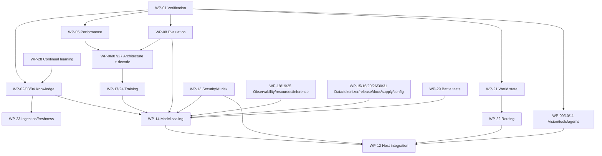

# Implementation Roadmap

_Last reviewed: 2026-10-01._

Stages are evidence gates, not delivery promises. The detailed dependency-ordered implementation map lives in [GitHub Issue #1](https://github.com/ORCHORDS-LCC/OAI-2.0/issues/1).

OAI-2.0 uses **runner-free local verification**. Do not make GitHub Actions runners part of an acceptance gate.

| Stage | Scope | Current status |
| --- | --- | --- |
| 0 | Public architecture/contracts | **IMPLEMENTED docs** |
| 1 | Host-neutral protocol/tool types | **EXPERIMENTAL scaffold** |
| 2 | Fast single-agent controllers | **EXPERIMENTAL scaffold** |
| 3 | Vision/UI grounding | **EXPERIMENTAL data model; real grounding PROPOSED** |
| 4 | Evidence verification | **EXPERIMENTAL scaffold** |
| 5 | Native multi-agent | **EXPERIMENTAL orchestration scaffold; real swarm PROPOSED** |
| 6 | Adaptive routing/depth/custom model | **PROPOSED** |
| 7 | Host adapters | **PROPOSED** |
| 8 | Production hardening | **IN PROGRESS foundations; production PROPOSED** |

## Master work-package map

The canonical detailed dependency map is [Master Issue #1](https://github.com/ORCHORDS-LCC/OAI-2.0/issues/1). Every detailed child work item is inserted into that master issue when created.

| Work package | Issue | Domain | Current state |
| --- | --- | --- | --- |
| WP-01 | [#2](https://github.com/ORCHORDS-LCC/OAI-2.0/issues/2) | Verification/validation | EXPERIMENTAL implementation in progress |
| WP-02 | [#3](https://github.com/ORCHORDS-LCC/OAI-2.0/issues/3) | Live Cloudflare knowledge | PROPOSED live / mock contract exists |
| WP-03 | [#4](https://github.com/ORCHORDS-LCC/OAI-2.0/issues/4) | Real q-pipe migration | PROPOSED |
| WP-04 | [#5](https://github.com/ORCHORDS-LCC/OAI-2.0/issues/5) | Semantic retrieval/evidence | PROPOSED |
| WP-05 | [#6](https://github.com/ORCHORDS-LCC/OAI-2.0/issues/6) | Performance baselines | EXPERIMENTAL harness / matrix remaining |
| WP-06 | [#7](https://github.com/ORCHORDS-LCC/OAI-2.0/issues/7) | Sparse routing/adaptive depth | PROPOSED |
| WP-07 | [#8](https://github.com/ORCHORDS-LCC/OAI-2.0/issues/8) | Decode optimization | PROPOSED |
| WP-08 | [#9](https://github.com/ORCHORDS-LCC/OAI-2.0/issues/9) | Capability/regression evaluation | EXPERIMENTAL scaffold / expansion remaining |
| WP-09 | [#10](https://github.com/ORCHORDS-LCC/OAI-2.0/issues/10) | Vision/UI grounding | EXPERIMENTAL data model / runtime remaining |
| WP-10 | [#11](https://github.com/ORCHORDS-LCC/OAI-2.0/issues/11) | Dynamic tool runtime | EXPERIMENTAL dispatcher / execution remaining |
| WP-11 | [#12](https://github.com/ORCHORDS-LCC/OAI-2.0/issues/12) | Native multi-agent | EXPERIMENTAL scaffold / runtime remaining |
| WP-12 | [#13](https://github.com/ORCHORDS-LCC/OAI-2.0/issues/13) | Host/protocol integrations | PROPOSED |
| WP-13 | [#14](https://github.com/ORCHORDS-LCC/OAI-2.0/issues/14) | Security and AI-risk hardening | IN PROGRESS / cross-cutting |
| WP-14 | [#15](https://github.com/ORCHORDS-LCC/OAI-2.0/issues/15) | Model scaling/final acceptance | PROPOSED |
| WP-15 | [#44](https://github.com/ORCHORDS-LCC/OAI-2.0/issues/44) | Training data/curriculum/provenance | PROPOSED |
| WP-16 | [#45](https://github.com/ORCHORDS-LCC/OAI-2.0/issues/45) | Tokenizer/control vocabulary | PROPOSED |
| WP-17 | [#46](https://github.com/ORCHORDS-LCC/OAI-2.0/issues/46) | Training/checkpoint/recovery stack | PROPOSED |
| WP-18 | [#47](https://github.com/ORCHORDS-LCC/OAI-2.0/issues/47) | Observability/trace telemetry | PROPOSED |
| WP-19 | [#48](https://github.com/ORCHORDS-LCC/OAI-2.0/issues/48) | Resource/memory/concurrency control | PROPOSED |
| WP-20 | [#49](https://github.com/ORCHORDS-LCC/OAI-2.0/issues/49) | Versioning/packaging/release reproducibility | PROPOSED |
| WP-21 | [#62](https://github.com/ORCHORDS-LCC/OAI-2.0/issues/62) | Repository world-state/context | PROPOSED |
| WP-22 | [#63](https://github.com/ORCHORDS-LCC/OAI-2.0/issues/63) | Difficulty/mode/compute routing | PROPOSED |
| WP-23 | [#64](https://github.com/ORCHORDS-LCC/OAI-2.0/issues/64) | Continuous knowledge ingestion/freshness | PROPOSED |
| WP-24 | [#65](https://github.com/ORCHORDS-LCC/OAI-2.0/issues/65) | Multi-objective model training | PROPOSED |
| WP-25 | [#66](https://github.com/ORCHORDS-LCC/OAI-2.0/issues/66) | Inference scheduling/batching/session runtime | PROPOSED |
| WP-26 | [#67](https://github.com/ORCHORDS-LCC/OAI-2.0/issues/67) | Documentation/traceability drift governance | PROPOSED |
| WP-27 | [#80](https://github.com/ORCHORDS-LCC/OAI-2.0/issues/80) | Core neural topology/fusion | PROPOSED |
| WP-28 | [#81](https://github.com/ORCHORDS-LCC/OAI-2.0/issues/81) | Verified continual learning | PROPOSED |
| WP-29 | [#82](https://github.com/ORCHORDS-LCC/OAI-2.0/issues/82) | Repository-scale battle tests | PROPOSED |
| WP-30 | [#83](https://github.com/ORCHORDS-LCC/OAI-2.0/issues/83) | Supply-chain integrity | PROPOSED |
| WP-31 | [#84](https://github.com/ORCHORDS-LCC/OAI-2.0/issues/84) | Configuration/secrets/profiles | PROPOSED |

## Current verification status

A runner-free local preflight now exists at `scripts/verify.py` and includes dependency sync, Ruff, MyPy, Pytest, public-safety scanning, and Markdown link checks. Its implementation was repaired to avoid generated-environment recursion and to fix the hard-coded-secret regex. **WP-01 is not complete until the local preflight is actually executed and the required evidence is recorded.**

## Immediate dependency-ordered gates

1. Complete WP-01 local verification evidence.
2. Prove corrected knowledge/importer regressions locally.
3. Implement WP-02 live Cloudflare transport.
4. Perform WP-03 small real q-pipe migration.
5. Establish WP-04 retrieval quality and WP-05 benchmark matrix.
6. Expand WP-08 held-out capability/regression gates.
7. Run small architecture/tokenizer/training probes before scaling.
8. Build real vision/tools/agent runtimes and host adapters.
9. Run repository-scale battle tests and risk/security gates.
10. Scale only when prerequisite evidence exists.

A capability is promoted only when its requirements, acceptance criteria, verification evidence, risks and documentation are current.
