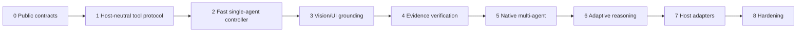

# Implementation roadmap

> **Status: PROPOSED.** Stages are validation gates, not delivery promises.

## Stage 0
Architecture, security boundaries, eval requirements, diagrams and contribution rules.

## Stage 1
Normalize multimodal messages, dynamic tools, results, cancellation, permissions and agent operations.

## Stage 2
Build the smallest useful single-agent controller and measure correct actions/stopping.

## Stage 3
Add screenshots, UI structure, localization and source-render mapping.

## Stage 4
Add explicit evidence and expected-vs-observed verification.

## Stage 5
Add spawn/delegate/message/join/cancel/merge with scoped capabilities and one integration owner.

## Stage 6
Train/evaluate FURIOUS, DEEP and SWARM routing under fixed budgets.

## Stage 7
Add host adapters only after inspecting and testing each public contract.

## Stage 8
Security, stress, recovery, cancellation, redaction and compatibility hardening.

A capability moves from PROPOSED only when code, tests and held-out evidence exist.
