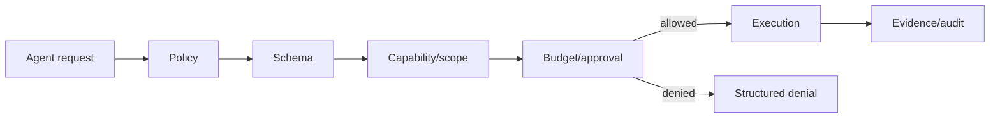

# Security and Sandboxing

_Last reviewed: 2026-10-02._

> **Current status:** security policy scaffolding exists; production autonomous execution security remains **PROPOSED** until hardened and adversarially tested.

## Current safeguards

Repository source currently includes:

- a six-gate tool dispatcher;
- runner-free local public-safety scanning via `scripts/verify.py`;
- secret/private-resource exclusions in repository policy;
- evidence/status modeling;
- non-commercial licensing/contact policy.

These are useful controls, not a complete autonomous-agent security boundary.

## Capability gate

## Prompt injection

Repository files, web pages, issue comments, screenshots/OCR, retrieved knowledge, and tool output are untrusted data. They cannot grant capabilities.

## GC/destructive knowledge operations

R2 cleanup must remain dry-run-first and authorization/recovery gated. KV/cache state is never sufficient authority for deletion. Current D1 lease/delete-boundary code is experimental and requires live concurrency/destructive proof before production use.

## Cloudflare

Bindings/secrets must live in deployment configuration, not public source. KV is cache-only and eventually consistent; authoritative state must not depend on immediate KV write visibility.

## Multi-agent isolation

Child agents cannot escalate beyond parent/runtime permissions. Shared state needs access control where secrets/private context ever exist.

## Evaluation

Test prompt injection, malicious tool descriptions, path escape, shell injection, exfiltration, privilege escalation, cross-agent leakage, resource exhaustion, unsafe retries, and false-success reporting.
