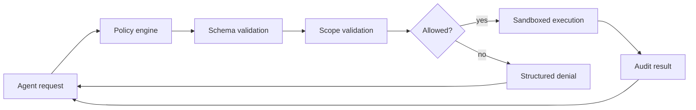
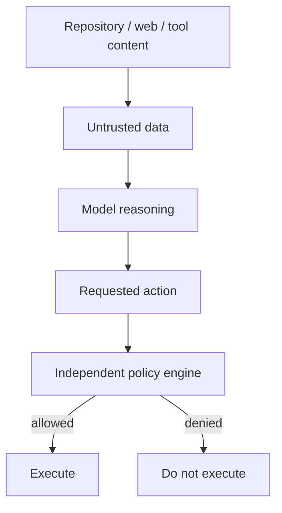

# Security and sandboxing

> **Status: PROPOSED requirements.**

Agentic coding combines untrusted repository content, tool output, network content, model output and potentially multiple agents. Prompts are not a security boundary.

## Prompt-injection boundary

Required controls include explicit workspace roots, path traversal defense, process/time/memory limits, network restrictions where appropriate, secret redaction, scoped credentials, per-agent capability isolation, approval policy for high-impact actions and auditable tool calls.

Test prompt injection, poisoned tool descriptions, path escape, shell injection, exfiltration attempts, privilege escalation, cross-agent leakage, resource exhaustion and unsafe retries.
