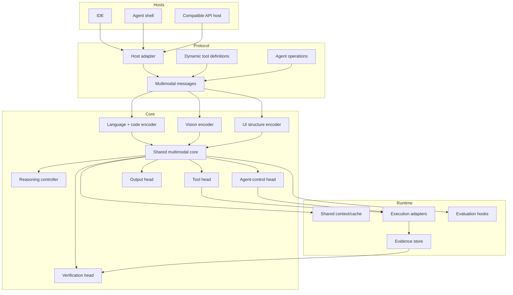
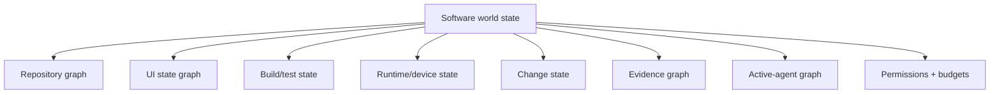

# System architecture

> **Status: PROPOSED.**

OAI-2.0 targets a portable coding foundation agent that treats text, code, screenshots, UI structure, tools, execution results and subagents as one software environment.



## World state



The main learning target is not only next-token prediction:

```text
(current state, goal, source, screen, history)
 -> next action
 -> expected result
 -> verification method
 -> evidence status
```

## Non-goals

- claiming literal zero hallucinations;
- forcing every task into multi-agent mode;
- replacing compilers/tests with model opinion;
- hard-coding one IDE's tool names;
- exposing private infrastructure;
- claiming frontier capability without benchmark evidence.
