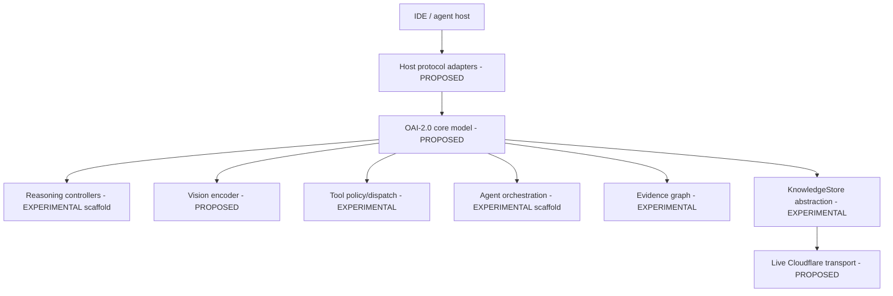

# System Architecture

_Last reviewed: 2026-10-01._

## Goal

Build a portable multimodal coding intelligence that treats code, language, UI state, screenshots, tools, test/runtime evidence, external knowledge, and subagents as one evolving software world.

## Current versus target



## Implemented scaffold

Current source contains typed protocol/tool models, reasoning controllers, agent specs/orchestrator interfaces, evidence graphs, vision-state abstractions, knowledge-store abstractions, corrected benchmark tooling, and capability evals.

It does **not** contain the trained final multimodal model.

## World state

The target world state covers:

- repository/symbol graph;
- build/test state;
- runtime/device state;
- UI/visual state;
- evidence/claim graph;
- external knowledge references;
- active agents and budgets;
- change/commit state.

Large shared artifacts should be referenced rather than repeatedly pasted into every agent context.

## Model objective

The architecture should learn more than next-token generation:

```text
(current world, goal, source, visual state, evidence, history)
 -> next action
 -> expected result
 -> verification method
 -> confidence/evidence status
```

See [ARCHITECTURE_TARGET.md](ARCHITECTURE_TARGET.md) and [CLOUDFLARE_KNOWLEDGE.md](CLOUDFLARE_KNOWLEDGE.md).
