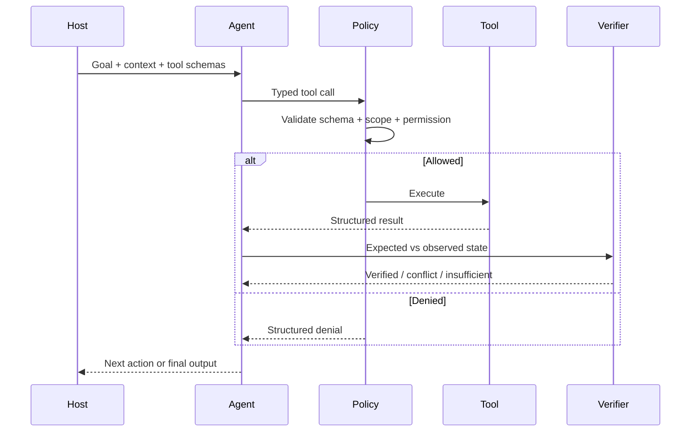
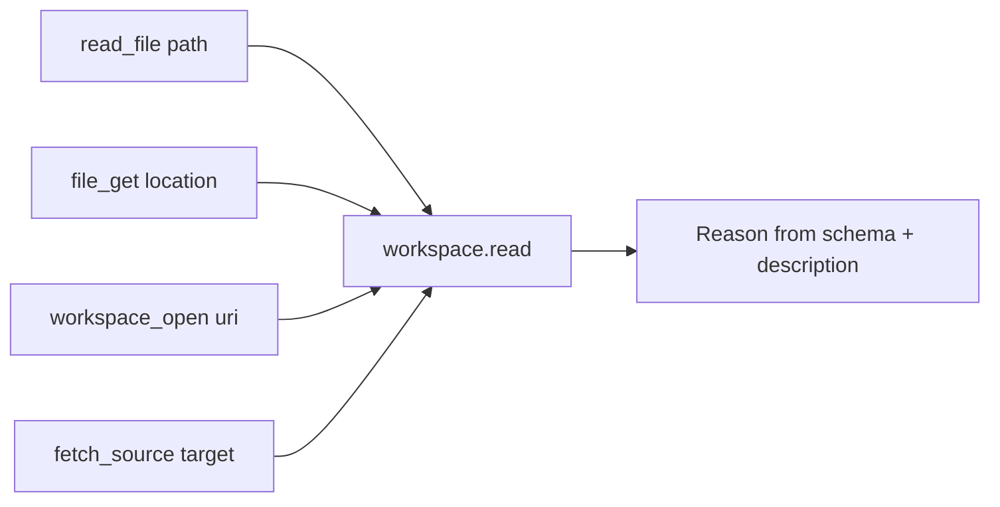
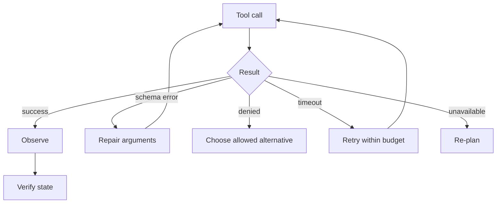

# Portable native tool calling

> **Status: PROPOSED.**

The host supplies tool names, descriptions, argument schemas, permissions and results at runtime. The model learns tool meaning from those definitions rather than memorizing one product's tool names.

## Lifecycle

## Semantic generalization

## Validation

Before execution:

1. tool exists;
2. arguments validate;
3. capability is allowed;
4. resource is in scope;
5. budget is respected;
6. high-impact actions satisfy host policy.

## Failure behavior

A tool error is never converted into a fabricated success.
