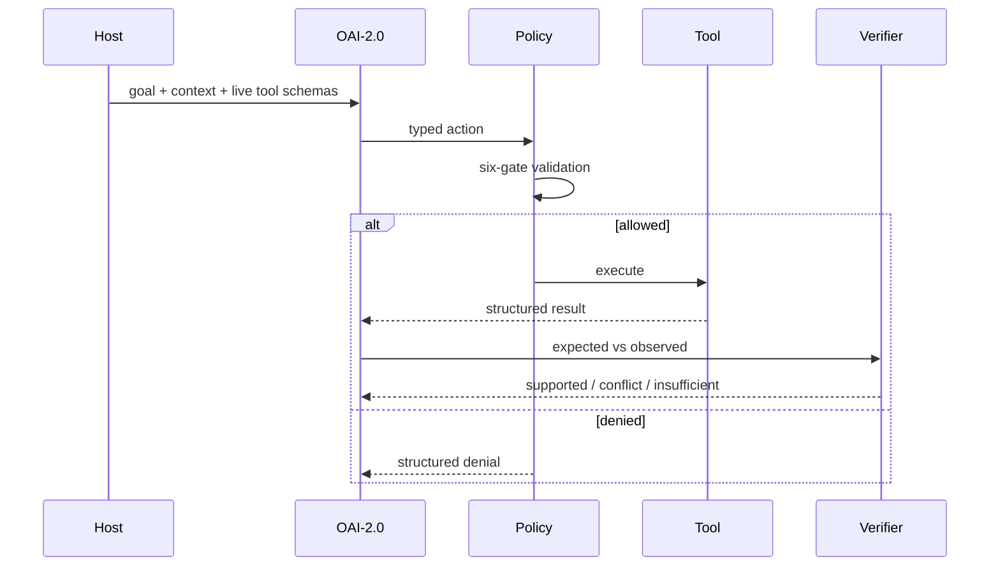

# Portable Native Tool Calling

_Reconciliation baseline: `c4a1f6f6134bd18668b8a621a2c0f0f89708e5e7` (source state before this documentation commit)._

_Last reviewed: 2026-10-02._

> **Current status:** dynamic tool schemas and a six-gate `ToolDispatcher` are **EXPERIMENTAL**. Production host adapters remain **PROPOSED**.

## Current boundary

The six-gate dispatcher is source-level experimental policy logic. It does not yet prove host discovery, live MCP/ACP capability negotiation, sandboxed execution, cancellation propagation, or production high-impact approval flows.

## Runtime contract

The host supplies tool name, description, schema, capabilities, scope, risk/approval requirements, and execution result at runtime.

The model should reason from semantics rather than memorizing fixed tool names.

## Current six-gate dispatcher

Current source checks, in order:

1. tool exists;
2. arguments satisfy the supplied schema;
3. required capability is granted;
4. requested resource is in scope;
5. task/tool budget permits the call;
6. high-impact action has the required approval.

A failed/denied call remains explicit state. It must not be converted into a fake success.

## Target lifecycle

## Compact actions

Compact internal action tokens remain a research direction for reducing unnecessary decode latency. Wire protocols may still require verbose JSON.

## Portability

OpenAI-compatible tools, MCP, ACP, and IDE-native integrations are adapter targets. None should be marked supported until versioned integration tests pass.
