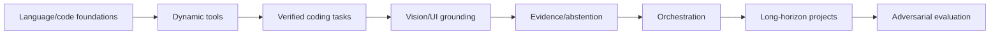

# Training and Evaluation Strategy

_Last reviewed: 2026-10-02._

> **Training status:** no final OAI-2.0 specialist model has been trained.  
> **Evaluation status:** an **EXPERIMENTAL** offline capability-eval scaffold exists.

## Current evaluation scaffold

Built-in offline suites cover:

- coding;
- tool use;
- bug diagnosis;
- reasoning;
- verification;
- vision;
- orchestration.

The scaffold can run locally against a runtime interface, including placeholder runtimes. OAI-2.0 acceptance is runner-free; these are foundation tests, not a claim of frontier capability.

## Benchmarking

Use `scripts/bench.py` for load/compile/warm-up, TTFT/prefill, MLX-reported generation throughput, end-to-end, and MLX memory metrics. Do not label the generation-throughput field as kernel-only/pure decode without a lower-level measurement proving that distinction.

Architecture decisions require repeated runs and real task success, not one prompt.

## Curriculum target

## Data rules

Training/eval data needs known provenance, permitted use, sensitive-data screening, deduplication/contamination tracking, and train/eval separation.

Production traces must not automatically become training data.

## Reference evaluators

External evaluators/teachers may generate critique or scenarios, but deterministic builds/tests/runtime/visual evidence should dominate where available. Public docs remain provider-neutral.

## Current promotion infrastructure

Current source includes QoS/tail/deadline promotion checks and admission/backpressure primitives. They are supporting gates, not a substitute for held-out capability, truth/evidence, safety, retrieval, vision, tool, and long-horizon acceptance.

## Promotion gate

A speed improvement is rejected if verified capability materially regresses.

Current QoS source separates research targets from service budgets and records first-useful-action, end-to-end p95/p99, verified-success, false-success, and deadline-miss metrics. The source-level promotion gate now rejects candidates whose p95/p99 or deadline-miss rate regress versus the baseline even when mean decode throughput improves. Admission/backpressure policy evidence and sustained target-hardware measurements must still be included for concurrent-service promotion.
