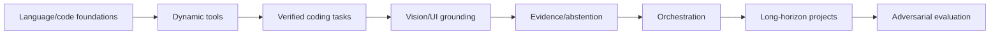

# Training and Evaluation Strategy

_Reconciliation baseline: `c4a1f6f6134bd18668b8a621a2c0f0f89708e5e7` (source state before this documentation commit)._

_Last reviewed: 2026-10-02._

> **Training status:** no final OAI-2.0 specialist model has been trained.  
> **Evaluation status:** an **EXPERIMENTAL** offline capability-eval scaffold exists.

## Current evaluation scaffold

Built-in offline suites cover:

- coding;
- tool use;
- bug diagnosis;
- reasoning;
- verification;
- vision;
- orchestration;
- multi-file reasoning;
- abstention;
- conflicting evidence.

Every capability case now carries explicit preconditions, execution procedure, expected patterns/results, and expected evidence. Deterministic scoring supports both any-pattern (`regex_or`) and all-required-pattern (`regex_all`) contracts so cases that require multiple independent facts cannot pass on one incidental match.

The scaffold can run locally against a runtime interface, including placeholder runtimes. OAI-2.0 acceptance is runner-free; these are foundation tests, not a claim of frontier capability.

## Benchmarking

Use `scripts/bench.py` for load/compile/warm-up, TTFT/prefill, MLX-reported generation throughput, end-to-end, and MLX memory metrics. Do not label the generation-throughput field as kernel-only/kernel-only decode without a lower-level measurement proving that distinction.

Architecture decisions require repeated runs and real task success, not one prompt.

## Curriculum target

## Data rules

Training/eval data needs known provenance, permitted use, sensitive-data screening, deduplication/contamination tracking, and train/eval separation.

Production traces must not automatically become training data.

## Reference evaluators

External evaluators/teachers may generate critique or scenarios, but deterministic builds/tests/runtime/visual evidence should dominate where available. Public docs remain provider-neutral.

## Truth/evidence evaluation status

Current source includes a versioned claim-evidence policy, repository/tool/web policy adapters, corrected conflicting-evidence state derivation, and deterministic WP-75 truth-evaluation primitives. `TruthPromotionBudget` can reject candidates exceeding false-success, unsupported-claim, stale-claim, ignored-contradiction, or unnecessary-abstention limits. WP-75 still requires broader repository/tool/web consumption plus adversarial hallucination/false-success gates before truth enforcement can be considered complete.

## Current promotion infrastructure

Current source includes QoS/tail/deadline promotion checks, admission/backpressure primitives, and an admission→scheduler bridge into safe batching. They are supporting gates, not a substitute for held-out capability, truth/evidence, safety, retrieval, vision, tool, and long-horizon acceptance.

## Numerical promotion gate

Current source includes a versioned reference precision policy, structured numerical sentinels, a reference-vs-optimized tolerance/fallback matrix, and a canonical `evaluate_numerical_candidate(...)` promotion gate for backend/export/kernel candidates. The gate records optional speedup evidence but never lets speed override numerical, finite-state, capability-regression or fallback failures. Real optimized backend/export/kernel measurements and local reproduction remain required before those paths are promoted.

## Promotion gate

A speed improvement is rejected if verified capability materially regresses.

Current QoS source separates research targets from service budgets and records first-useful-action, end-to-end p95/p99, verified-success, false-success, and deadline-miss metrics. The source-level promotion gate now rejects candidates whose p95/p99 or deadline-miss rate regress versus the baseline even when mean decode throughput improves. Admission/backpressure policy evidence and sustained target-hardware measurements must still be included for concurrent-service promotion.

## Adversarial truth promotion

Current source now includes a deterministic held-out truth-case runner. The candidate runtime receives only a public `CandidateTruthInput(case_id, prompt)`; hidden verifier evidence and the case class remain available only to the independent verifier callback. The runner maps independent verdicts into supported, correct/unnecessary abstention, unsupported claim, false success, stale claim and ignored-contradiction outcomes while preserving evidence-policy/runtime/source versions.

Truth promotion is also coupled to verified-task regression. A speedup is recorded as evidence only; it cannot override a truth-budget failure or an excessive verified-task regression. This prevents a faster/shorter candidate from being promoted solely because throughput improved while misleading claims worsened.

The remaining WI-TRUTH-002 boundary is empirical: execute a genuinely held-out corpus against a baseline and candidate, keep verifier evidence inaccessible during generation, and record materially lower fabrication/false-success rates without unacceptable verified-task loss.

## Held-out capability regression gate

WI-EVAL-002 now has a source-level held-out promotion gate in `oai2/evals/regression.py`.

The gate requires:

- baseline and candidate reports over identical held-out case IDs;
- explicit rejection when any held-out case overlaps declared training/tuning case IDs;
- explicit per-capability pass-rate and mean-score regression tolerances;
- an abstention-accuracy floor;
- a false-success-rate ceiling;
- explicit thresholds for every candidate capability, so aggregate gains cannot hide an unbudgeted category regression.

A candidate that improves coding while materially degrading verification is rejected even if its aggregate result looks better. A non-regressing control candidate passes under the same declared budget.
