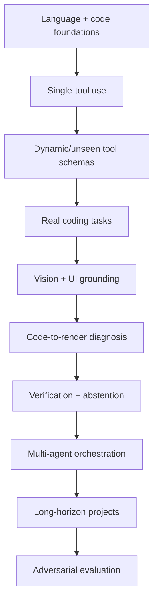
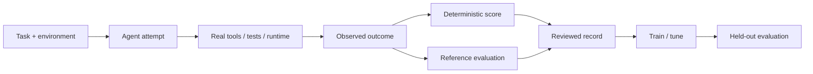

# Training and evaluation strategy

> **Status: PROPOSED.** Public documentation is provider-neutral and excludes private datasets, providers, infrastructure and sensitive training sources.

## Capability curriculum

## Training records

Use auditable task artifacts: goals, acceptance criteria, available tools, tool calls/results, screenshots/UI state, patches, compiler/test/runtime outcomes, evidence references and success/failure labels.

Do not require reproducing any model's private hidden reasoning.

## Reference evaluation

External reference systems may create scenarios, critiques or preference labels, but deterministic execution should dominate when available.

Tool schemas should be randomized. Held-out tests must include unseen names and shapes.

Negative examples should include hallucinated tools, fake test claims, bad screenshots, regressions, unnecessary swarms, unsafe actions and wrong stopping behavior.
