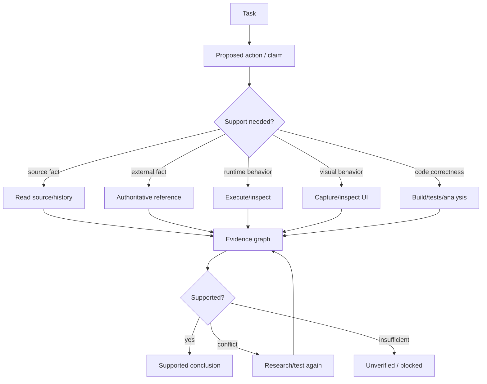

# Verification and evidence

> **Status: PROPOSED.**

The goal is to sharply reduce unsupported output through explicit evidence and execution checks. It does not promise literal zero hallucination.



Evidence classes include user intent, repository source, change history, deterministic execution, runtime observation, visual observation, authoritative external sources and model hypotheses.

```text
"looks fixed"
 < patch parses
 < targeted test passes
 < relevant suite/build passes
 < requested runtime behavior is reproduced
 < regression checks and acceptance criteria pass
```

A blocked result is valid. Fabricated completion is not.
