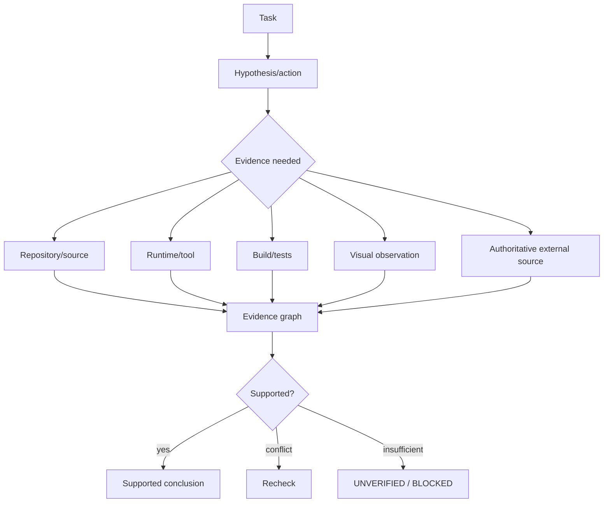

# Verification and Evidence

_Reconciliation baseline: `c4a1f6f6134bd18668b8a621a2c0f0f89708e5e7` (source state before this documentation commit)._

_Last reviewed: 2026-10-02._

> **Current status:** typed evidence/claim structures, conflicting-evidence state derivation, a versioned claim-evidence policy, and repository/tool/web policy adapters are **EXPERIMENTAL**. A deterministic truth-evaluation layer now tracks false success, unsupported claims, stale claims, contradictions and abstention with a versioned promotion budget. A held-out runner keeps verifier evidence outside the candidate input, and truth promotion is coupled to verified-task regression so speed cannot override misleading-claim failures. Actual held-out baseline/candidate execution and current-main local verification remain open before automatic enforcement is proven.

## Principle

Model confidence is not proof.



## Evidence classes

User intent, repository source, history, deterministic execution, runtime/device state, visual state, primary external references, secondary references, and model hypotheses should remain distinguishable.

## Coding proof hierarchy

```text
plausible explanation
 < patch parses
 < targeted test
 < relevant build/suite
 < requested runtime state reproduced
 < regression/acceptance checks
```

## False-success boundary

A generated claim is not verified merely because the model is confident, a tool returned text, or an earlier issue comment said “fixed.” Current-source evidence, freshness, contradiction state, and the owning acceptance criteria must determine support. Unsupported current-state claims should remain UNVERIFIED / NEED_MORE_EVIDENCE / BLOCKED.

## Knowledge evidence

External knowledge objects carry source URI, content hash, retrieval time, authority, lifecycle status, and future artifact/vector references.

q-pipe knowledge does not become active shared knowledge simply because it exists; it must pass the strict import gate.


## Versioned claim/evidence policy

Current source now includes an **EXPERIMENTAL** versioned claim/evidence policy in `oai2/verification/policy.py`.

Claim classes are explicit:

- repository state;
- tool/runtime observation;
- current external fact;
- stable external fact;
- inference;
- assumption;
- plan;
- target;
- preference;
- hypothetical content.

The policy distinguishes evidence-requiring claims from declarations that should not be forced through external evidence. Repository/tool claims are state-version scoped. Current external facts require an observation/retrieval time and a caller-supplied freshness window; the repository does **not** hard-code one universal age limit for every domain.

Policy outcomes are explicit: `NOT_REQUIRED`, `NEEDS_EVIDENCE`, `SUPPORTED`, `REFUTED`, `STALE`, or `CONFLICTING`. Every assessment carries the evidence-policy version. Changed repository/tool state invalidates prior state-scoped support instead of silently inheriting it.

Focused fixtures cover taxonomy, state-version invalidation, current-fact expiry, conflict/refutation, wrong-evidence-class rejection, and assumption/plan/target/preference/hypothetical paths that do not require external evidence.

Repository, tool/runtime, and web/external evidence paths now consume this policy through the canonical `oai2/verification/paths.py` adapters. Those adapters enforce the matching evidence classes at the path boundary and preserve state-version/freshness/refutation/conflict semantics. The remaining WI-TRUTH-001 closure boundary is current-main runner-free local verification.

## Rendered evidence-context budget (WI-RET-002)

`build_evidence_package(...)` applies the caller's deterministic token counter to
the complete rendered package, including provenance and separators. Its
`token_count` equals `token_counter(package.render())` and never exceeds the
requested `token_budget`. Independently counted entry costs are diagnostic;
their sum is not the package budget because concatenated text can have a
different encoded cost.

Each proposed snippet is checked together with the already selected entries.
Provenance is never removed merely to make a snippet fit. Even an empty package
uses the counter's empty-string cost; a budget below that cost raises
`ValueError`. Callers must use the target runtime's tokenizer and account for
other prompt content separately. This formatter does not guarantee globally
maximal content selection for an arbitrary non-monotonic token counter.

Focused verification in the supported project environment:

```bash
uv run pytest -W error \
    tests/test_evidence_package.py \
    tests/test_evidence_package_budget.py \
    tests/test_evidence_package_validation.py
```

The three test files cover complementary surfaces:

- `test_evidence_package.py` — behavioural: inner-tuple integrity guards (missing
  candidate, hash mismatch, missing provenance, negative counter result).
- `test_evidence_package_budget.py` — budget mechanics: deterministic synthetic
  counters, encoded-cost vs. summed-cost invariant, empty-package feasibility,
  per-snippet inclusion ordering.
- `test_evidence_package_validation.py` — outer guard rails: 49 parametrized
  negative-path tests pinning every `ValueError` raise site in
  `oai2/knowledge/evidence_package.py` — `token_budget` shape (zero / negative /
  non-int / bool), `max_entries` shape (zero / negative / non-int / bool /
  callable — `None` is excluded because the source uses `is not None` as the
  "unset" sentinel), `token_counter` callability, empty-package feasibility,
  `raw_source_tokens` shape, empty `relevant_knowledge_ids`, and `_rate`
  out-of-range / non-numeric (parametrized over 8 edge values × 2 rate
  arguments). `bool` is intentionally pinned because `bool` is a subclass of
  `int` in Python; the source's explicit `isinstance(value, bool)` short-circuit
  is what keeps the error message consistent instead of `True` silently passing
  as `1`.

The budget fixtures use deterministic synthetic counters, not measurements of
a deployed model. Live retrieval quality, task-success improvement, and full
supported-environment verification remain separate acceptance requirements.

### Cross-repo `__main__` boundary test (slice 19)

The cross-repo seam smoke (`scripts/backend_smoke.py`) drives
`run_eval_harness()` end-to-end through `select_runtime_from_env()` and a
mocked `GatewayRuntime`, with no live token required. Its
`if __name__ == "__main__":` block is the boundary that
`scripts/verify.py backend-smoke` invokes; an exception there must be
translated to `SystemExit(2)` with `raise ... from exc` so the traceback
chain is preserved for CI logs. Two tests in `tests/test_backend_smoke.py`
pin that boundary:

1. **runpy-driven success-path test** — drives the actual `__main__` block
   via `runpy.run_module('scripts.backend_smoke', run_name='__main__',
   alter_sys=True)`, captures stdout, asserts `SystemExit(0)` and the
   `PASS backend-smoke:` prefix. Wrapped in `warnings.catch_warnings()` with a
   targeted `filterwarnings("ignore", message=...)` so the benign runpy
   `found in sys.modules after import of package 'scripts'` warning does not
   leak through `scripts/verify.py`'s `-W error` escalation. Other warnings
   still propagate.
2. **source-pin test** — reads the script's source and asserts the literal
   strings `except Exception as exc`, `raise SystemExit(2) from exc`, and
   `FAIL backend-smoke: unexpected ` remain in the `__main__` block so the
   exception-translation contract cannot silently regress.

The failure-path runpy test was deliberately not added: `runpy.run_module`
reloads the target module from disk on every call and does not respect
cached-symbol patches (the `found in sys.modules` warning is the smoking
gun). The failure path is already pinned end-to-end by
`test_backend_smoke_prints_fail_when_runtime_init_raises` (subprocess
boundary wrapper) plus the two in-process `main()`-level forced-failure
tests covering exit 1 (selector mismatch + `scores != n_cases`) and exit 2
(construction failure).

### Live wire evidence (slice 19)

The first end-to-end run of the cross-repo seam against the real
`https://api.orchords.com` (with the ORCHORDS ZCode provider key in the
gitignored `.env`, never echoed in this doc or any commit):

| Probe | Model | Result |
| --- | --- | --- |
| `scripts/gateway_smoke.py` | `orchordsai-m3` | 200 OK / 2289.667 ms / tokens=2 / text="pong" |
| `scripts/bench.py --backend=gateway --repetitions=2` | `orchordsai-m3` | 2/2 runs PASS; warm prefill TPS cold 4.910 → warm 402.114 (~82× speedup), gen=82 tok/run |
| `oai2.evals.run_eval_harness(suite='coding_basic')` | `orchordsai-m3` | 3/3 cases PASS through `select_runtime_from_env()` → GatewayRuntime → api.orchords.com |
| `scripts/gateway_smoke.py` | `oai-1.2` | 503 location-unavailable (cloud-side, see issue #237) |
| `scripts/gateway_smoke.py` | `orchordsai-gpt` | 502 bad-gateway (cloud-side) |
| `scripts/gateway_smoke.py` | `oai-1.0` | 200 OK |

The bench summary artifact (`evals/benchmarks/summary_gateway-orchordsai-m3.json`)
plus the two per-run files are committed alongside this slice and serve as
the first live wire evidence that the `bench.py --backend=gateway` path
produces the same schema as the MLX/local backend. With the operator-supplied
`OAI2_GATEWAY_MODEL=orchordsai-m3` override, `scripts/verify.py gateway-reach`
remains the only failing sub-check — the failure is on issue #237's
cloud-side 4-model exposure (`['oai-1.0', 'orchordsai-gpt', 'orchordsai-m3']`
vs. expected `oai-1.2` only) and is out of source-side scope. Once the
q-pipe deployment restricts the model list to one, the local verifier
chain becomes the canonical acceptance gate without any token-based
workaround. Update 2026-10-02 (Refs #237): the deployment now exposes
exactly one model id, `oai-2.0`; `scripts/verify.py gateway-reach`
passes against the default configuration and the verifier chain is the
canonical acceptance gate as described. The probe table above is
retained as the historical record of the pre-fix wire state.
