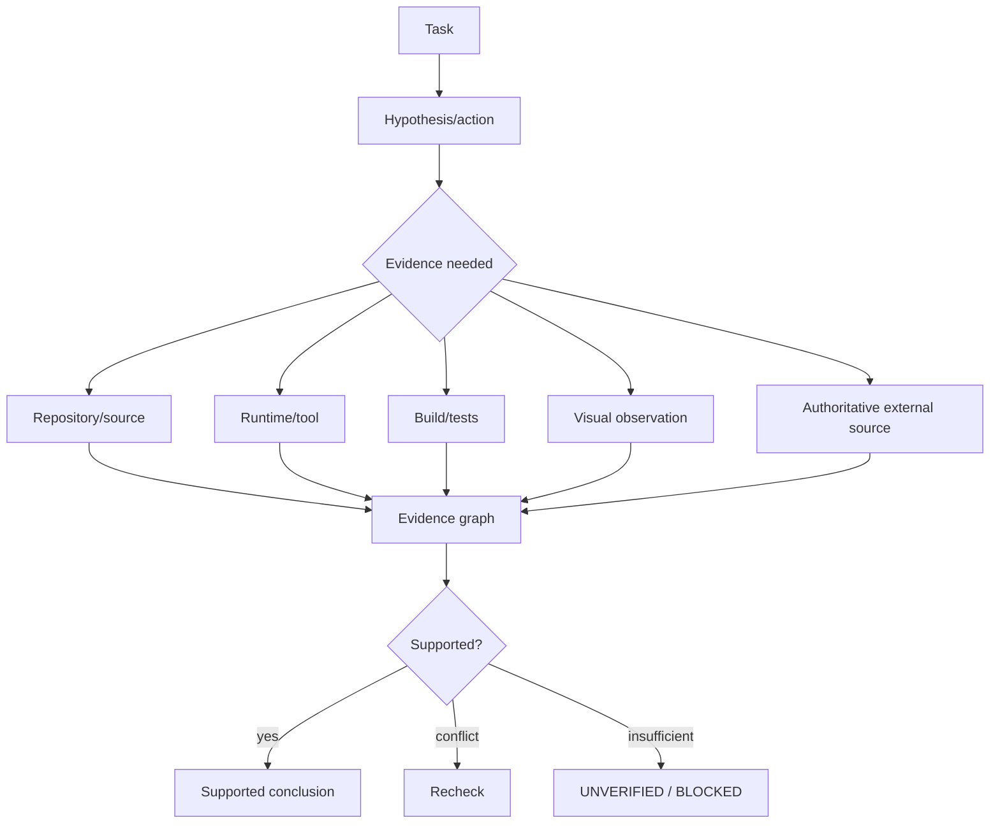

# Verification and Evidence

_Last reviewed: 2026-10-01._

> **Current status:** typed evidence/claim structures and evidence-graph behavior are **EXPERIMENTAL**. Full automatic claim-to-source enforcement in final generation is still **PROPOSED**.

## Principle

Model confidence is not proof.



## Evidence classes

User intent, repository source, history, deterministic execution, runtime/device state, visual state, primary external references, secondary references, and model hypotheses should remain distinguishable.

## Coding proof hierarchy

```text
plausible explanation
 < patch parses
 < targeted test
 < relevant build/suite
 < requested runtime state reproduced
 < regression/acceptance checks
```

## Knowledge evidence

External knowledge objects carry source URI, content hash, retrieval time, authority, lifecycle status, and future artifact/vector references.

q-pipe knowledge does not become active shared knowledge simply because it exists; it must pass the strict import gate.
