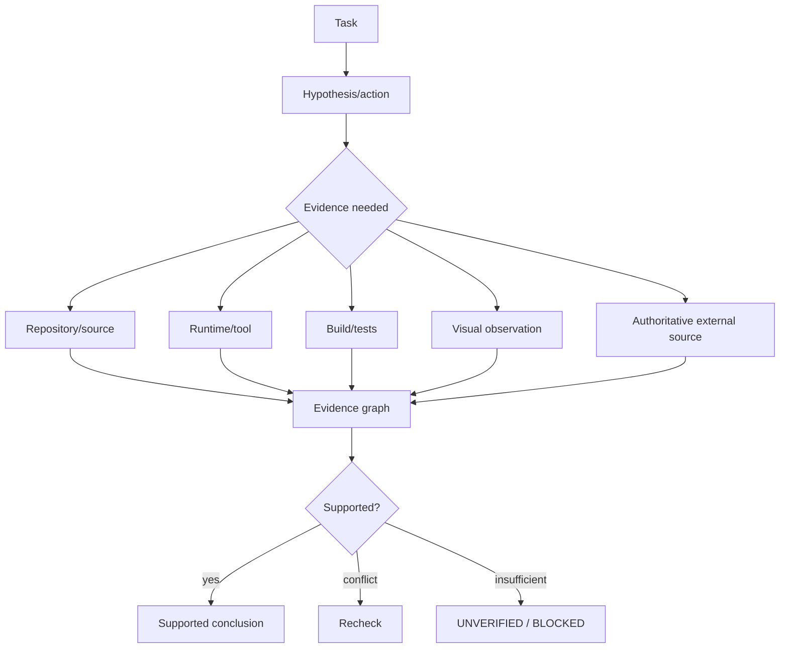

# Verification and Evidence

_Reconciliation baseline: `c4a1f6f6134bd18668b8a621a2c0f0f89708e5e7` (source state before this documentation commit)._

_Last reviewed: 2026-10-02._

> **Current status:** typed evidence/claim structures, conflicting-evidence state derivation, and a versioned claim-evidence policy are **EXPERIMENTAL**. WP-75 (#226–#228) still requires repository/tool/web consumption, freshness/version invalidation wiring, and adversarial false-success/hallucination gates before automatic enforcement is proven.

## Principle

Model confidence is not proof.



## Evidence classes

User intent, repository source, history, deterministic execution, runtime/device state, visual state, primary external references, secondary references, and model hypotheses should remain distinguishable.

## Coding proof hierarchy

```text
plausible explanation
 < patch parses
 < targeted test
 < relevant build/suite
 < requested runtime state reproduced
 < regression/acceptance checks
```

## False-success boundary

A generated claim is not verified merely because the model is confident, a tool returned text, or an earlier issue comment said “fixed.” Current-source evidence, freshness, contradiction state, and the owning acceptance criteria must determine support. Unsupported current-state claims should remain UNVERIFIED / NEED_MORE_EVIDENCE / BLOCKED.

## Knowledge evidence

External knowledge objects carry source URI, content hash, retrieval time, authority, lifecycle status, and future artifact/vector references.

q-pipe knowledge does not become active shared knowledge simply because it exists; it must pass the strict import gate.


## Versioned claim/evidence policy

Current source now includes an **EXPERIMENTAL** versioned claim/evidence policy in `oai2/verification/policy.py`.

Claim classes are explicit:

- repository state;
- tool/runtime observation;
- current external fact;
- stable external fact;
- inference;
- assumption;
- plan;
- target;
- preference;
- hypothetical content.

The policy distinguishes evidence-requiring claims from declarations that should not be forced through external evidence. Repository/tool claims are state-version scoped. Current external facts require an observation/retrieval time and a caller-supplied freshness window; the repository does **not** hard-code one universal age limit for every domain.

Policy outcomes are explicit: `NOT_REQUIRED`, `NEEDS_EVIDENCE`, `SUPPORTED`, `REFUTED`, `STALE`, or `CONFLICTING`. Every assessment carries the evidence-policy version. Changed repository/tool state invalidates prior state-scoped support instead of silently inheriting it.

Focused fixtures cover taxonomy, state-version invalidation, current-fact expiry, conflict/refutation, wrong-evidence-class rejection, and assumption/plan/target/preference/hypothetical paths that do not require external evidence.

The remaining WI-TRUTH-001 boundary is runtime consumption: repository, tool/runtime, and web-research paths must call this policy consistently, and the current-main runner-free local verification gate must be recorded before closure.
