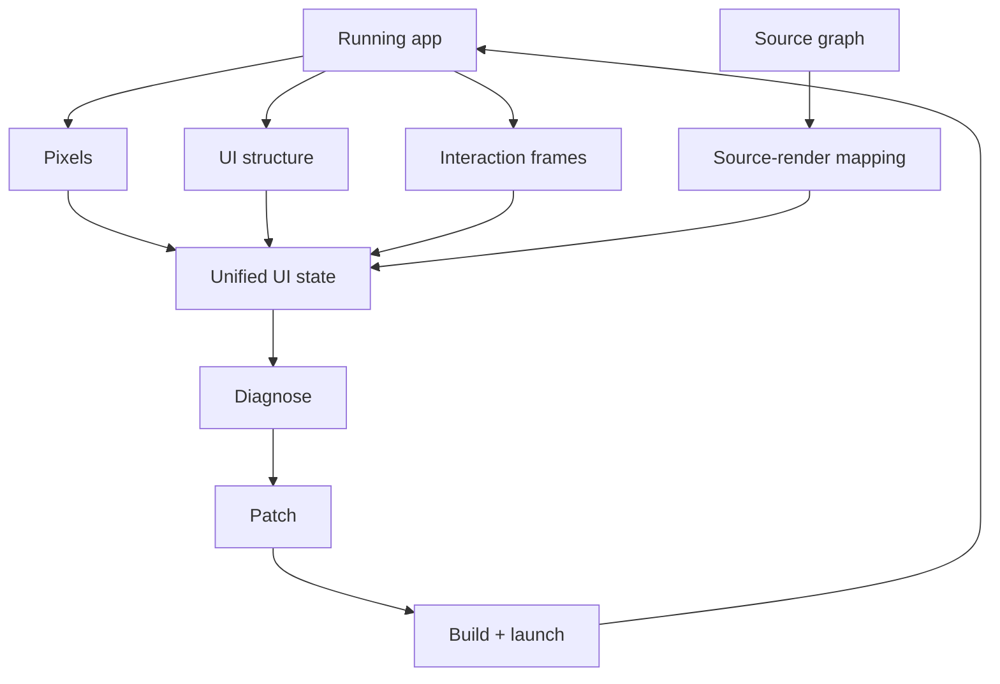
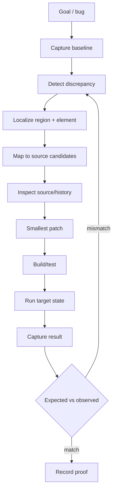
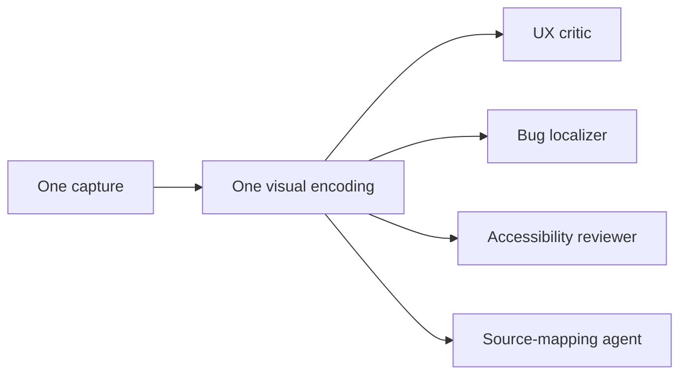

# Vision, UI testing, aesthetics and UX

> **Status: PROPOSED.**

Vision is a first-class coding capability because UI defects frequently exist only in rendered behavior.

## Four views

- pixels;
- UI/accessibility structure;
- source-to-render mapping;
- temporal interaction frames.

## Visual debugging loop

## Objective checks

Clipping, overlap, contrast, interaction target size, insets, text overflow, state transitions, blank frames, crashes, accessibility mismatches and approved screenshot regressions.

## Preference checks

Hierarchy, balance, typography, spacing, color coherence, density, perceived polish, discoverability, feedback clarity and task friction.

## Shared visual encoding

Prefer structured device/IDE actions over blind coordinate clicking. Always observe the resulting state.
