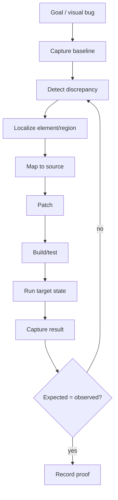

# Vision, UI Testing, Aesthetics and UX

_Last reviewed: 2026-10-01._

> **Current status:** four-view data abstractions are **EXPERIMENTAL**. A trained vision encoder, real device pipeline, temporal visual reasoning, and automated aesthetics/UX model are still **PROPOSED**.

## Four target views

1. pixels/screenshots;
2. semantic/accessibility/UI structure;
3. source-to-render mapping;
4. temporal interaction frames.

Current source can represent these views and decode image bytes for basic tests. That is not equivalent to visual intelligence.

## Target debugging loop

## Objective checks

Future deterministic/visual checks should cover clipping, overlap, contrast, tap targets, insets, overflow, navigation state, blank frames, crashes, accessibility mismatches, and approved visual regressions.

## Preference checks

Aesthetics/UX preference scoring should remain separate from objective correctness. Project-specific taste needs human/reference calibration.

## Performance

Visual encodings should be cached and shared across subagents; vision should not run on code-only turns.
